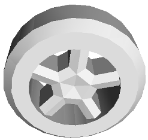
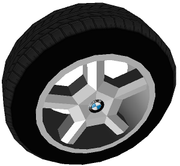

## AutomobileWheel

The `AutomobileWheel` allows the user to easily create automobile wheels. It is
designed to be generic and customizable to cover a wide range of wheel
configurations. The base node of the `AutomobileWheel` PROTO is a `Slot` of type
`automobile wheel` so that it can only be inserted as a wheel of an automobile
PROTO featuring the corresponding `automobileWheel` slots.

%figure "An AutomobileWheel PROTO with the default field value"



%end

```
AutomobileWheel {
  SFString   name               "automobile wheel"
  SFFloat    thickness          0.3
  SFFloat    tireRadius         0.4
  SFInt32    subdivision        24
  SFFloat    curvatureFactor    0.35
  SFInt32    edgeSubdivision    1
  SFFloat    rimRadius          0.28
  SFInt32    rimBeamNumber      5
  SFFloat    rimBeamWidth       0.1
  SFFloat    centralInnerRadius 0.09
  SFFloat    centralOuterRadius 0.13
  SFFloat    rimBeamThickness   0.2
  SFFloat    rimBeamOffset      0.03
  SFString   contactMaterial    "default"
  SFNode     tireAppearance     Appearance { material Material {} }
  SFNode     rimAppearance      Appearance { material Material {} }
  SFNode     physics            Physics {}
  MFNode     logoSlot           [ ]
}
```

### AutomobileWheel Field Summary

- `name`: Identifies the wheel.
- `thickness`: Defines the thickness of the wheel.
- `tireRadius`: Defines the outer radius of the wheel.
- `subdivision`: Defines the number of subdivisions for the cylinder
approximation.
- `curvatureFactor`: Defines the curvature of the wheel, should be between 0 and
1.
- `edgeSubdivision`: Defines the number of subdivisions for the edge
approximation.
- `rimRadius`: Defines the radius of the separation between the rim and the tire.
- `rimBeamNumber`: Defines the number of beams of the wheel.
- `rimBeamWidth`: Defines the width of the beams.
- `centralInnerRadius and centralOuterRadius`: Defines the geometry of the central
part of the wheel.
- `rimBeamThickness`: Defines the lateral thickness of the beams.
- `rimBeamOffset`: Defines the lateral offset of the beams.
- `contactMaterial`: Defines the `contactMaterial` used for the wheel.
- `tireAppearance`: Specifies the appearance of the tire.
- `rimAppearance`: Specifies the appearance of the rim.
- `physics`: `Physics` node of the wheel defining all the physical
characteristics.
- `logoSlot`: extension slot allowing the user to add a `Shape` node for a brand
logo.

Some sample instances of wheels are provided (see for example
`BmwX5Wheel.proto`) which inherit from `AutomobileWheel`.

%figure "Example of modeling of a BMW X5 wheel using the AutomobileWheel PROTO"



%end
