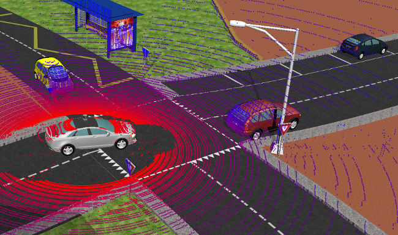
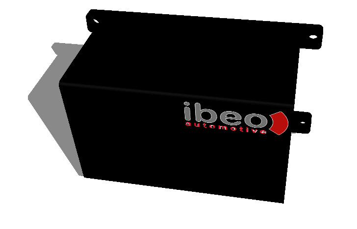
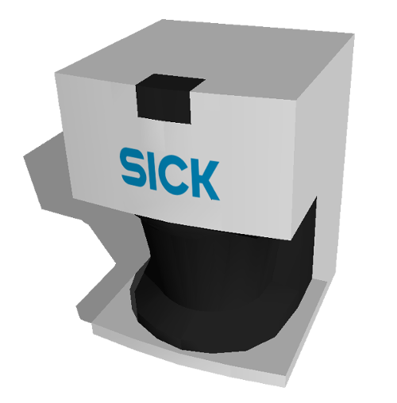
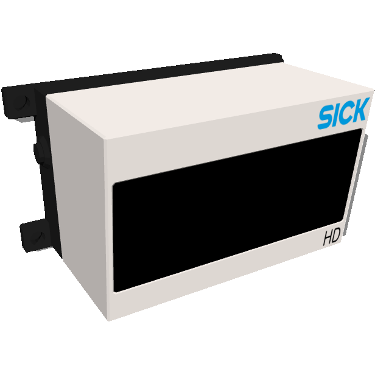
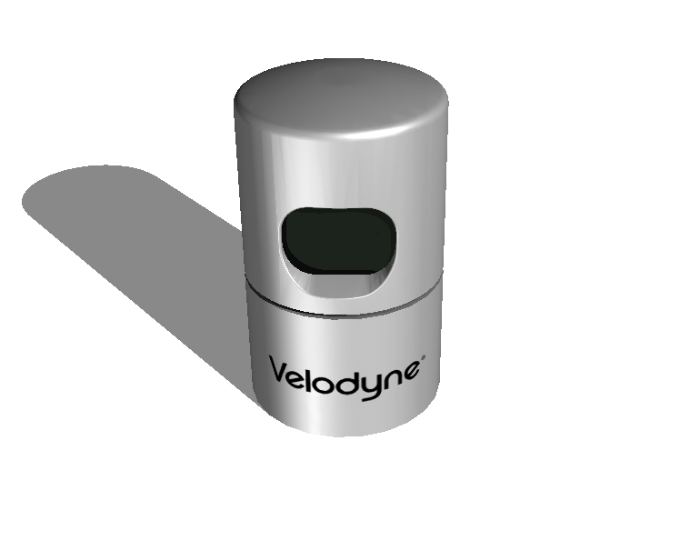
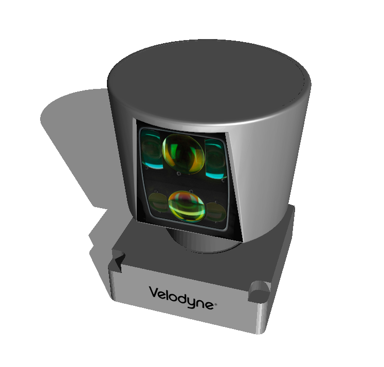

## Lidar Sensors

A wide range of lidar sensors have been modelled.

%figure "Lidar simulation"



%end

### Ibeo Lux

The `IbeoLux` is a 4 layers lidar with a range of up to 200 meters and a field of view of up to 110 degrees, it returns 680 points per layer per scan.

The model of the `IbeoLux` contains a spherical projection, a fixed resolution of 0.04 meter and a gaussian noise with a standard deviation of 0.1 meter.

%figure "Ibeo Lux lidar"



%end

```
IbeoLux {
  SFVec3f    translation             0 0 0
  SFRotation rotation                0 1 0 0
  SFString   name                    "ibeo"
  SFBool     useExtendedFieldOfView  FALSE
  SFBool     fastModel               FALSE
}
```

The `IbeoLux` PROTO can either be used in normal field of view mode (80 degrees field of view) or in extended field of view mode (110 degrees field of view) depending on the value of the `useExtendedFieldOfView` field.

The `fastModel` field can be used to simplify the model of the sensor by removing the spherical projection, the noise and the limited resolution in order to speed up the simulation.


### Sick

#### Sick Lms 291

The `Sick Lms 291` is a 1 layer lidar with a range of up to 80 meters and a field of view of up to 180 degrees.

The model of the `Sick Lms 291` contains a spherical projection, a configurable fixed resolution and a configurable gaussian noise.

%figure "Sick Lms 291 lidar"



%end

```
SickLms291 {
  SFVec3f translation 0 0 0
  SFRotation rotation  0 1 0 0
  SFString name "lms291"
  SFFloat noise 0.0
  SFInt32 resolution 180
}
```

The `noise` field specifies the standard deviation of the gaussian depth noise in meters.

The `resolution` field specifies the number of points returned per layer per scan.

#### Sick LD-MRS

The `Sick LD-MRS` is a 2 or 4 layers lidar with a range of 300 meters and a field of view of respectively 110 or 85 degrees.

The top and bottom layers are split horizontally with an angle of 2.4 degrees.
Layer 0 corresponds to the bottom layer.
First response values are corresponding to the device right.
The frustum cone is shifted to the right by an offset angle of 7.5 degrees when 4 layers are set, and 5 degrees when 2 layers are set.

%figure "Sick LD-MRS lidar"



%end

```
SickLdMrs {
  SFVec3f translation 0 0 0
  SFRotation rotation 0 1 0 0
  SFString name "LD-MRS"
  SFFloat noise 0.3
  SFInt32 numberOfLayers 4
  SFFloat angularResolution 0.008726646259972
  SFBool physics TRUE
}
```

The `noise` field specifies the standard deviation of gaussian image noise in meters.

The `numberOfLayers` field specifies the number of horizontal layers. It can be either 2 or 4.

The `angularResolution` field specifies the vertical angular gap between two measurements.
From the `Sick LD-MRS` specification, it can be either 0.125, 0.25 or 0.5 degrees (to be converted in radians).

The `physics` field specifies if the sensor should be affected by physics (mass = 1 [kg]) or not.

### Velodyne

All the models of velodyne sensors are available.

#### Velodyne VLP 16

The `Velodyne VLP 16` is a 16 layers lidar with a range of up to 100 meters and a field of view of 360 degrees, it returns 3600 points per layer per scan.

The model of the `Velodyne VLP 16` contains a spherical projection and a gaussian noise with a standard deviation of 0.03 meter.

%figure "Velodyne VLP 16 model"


%end

```
VelodyneVLP-16 {
  SFVec3f    translation    0 0 0
  SFRotation rotation       0 1 0 0
  SFString   name           "velodyne"
  SFBool     fastModel      FALSE
}
```

The `fastModel` field can be used to simplify the model of the sensor by removing the noise in order to speed up the simulation.

#### Velodyne HDL 32E

The `Velodyne HDL 32E` is a 32 layers lidar with a range of up to 70 meters and a field of view of 360 degrees, it returns 4500 points per layer per scan.

The model of the `Velodyne HDL 32` contains a gaussian noise with a standard deviation of 0.02 meter and a rotating head.

%figure "Velodyne HDL 32E lidar"



%end

```
VelodyneHDL-32E {
  SFVec3f    translation    0 0 0
  SFRotation rotation       0 1 0 0
  SFString   name           "velodyne"
  SFBool     fastModel      FALSE
}
```

The `fastModel` field can be used to simplify the model of the sensor by removing the noise in order to speed up the simulation.

#### Velodyne HDL 64E

The `Velodyne HDL 64E` is a 64 layers lidar with a range of up to 120 meters and a field of view of 360 degrees, it returns 4500 points per layer per scan.

The model of the `Velodyne HDL 64` contains a gaussian noise with a standard deviation of 0.02 meter and a rotating head.

%figure "Velodyne HDL 64E lidar"



%end

```
VelodyneHDL-32E {
  SFVec3f    translation    0 0 0
  SFRotation rotation       0 1 0 0
  SFString   name           "velodyne"
  SFBool     fastModel      FALSE
}
```

The `fastModel` field can be used to simplify the model of the sensor by removing the noise in order to speed up the simulation.
