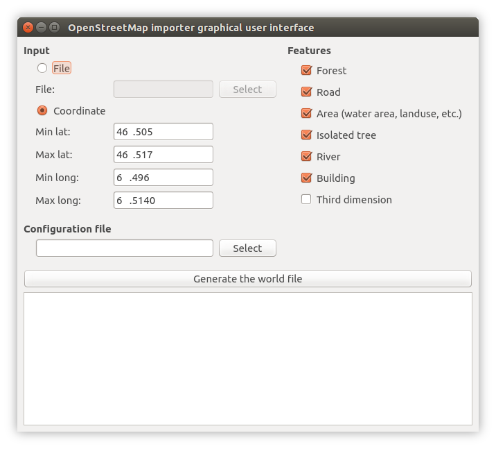

## OpenStreetMap importer

In order to ease the creation of new environments for automobile simulations, a
script has been created to convert maps from OpenStreetMap into Webots worlds.

You can download a map of any part of the world from
[www.openstreetmap.org/export](http://www.openstreetmap.org/export) (do not use
more than a few kilometers square if you want to be able to run your simulation
in real-time). And then convert it using the script.

The script is written in python, a typical usage is:

```
python importer.py --inputFile=myMap.osm --outputFile=myWorld.wbt
```

This command will create the file called `myWorld.wbt` and if there is some
forest in the map, it will generate a `forest` folder too. This `forest` folder
contains the [forest files](nature.md#forest) of the forests present in the
world.

You can use several arguments with this script:

%figure "OpenStreetMap importer arguments"

| Argument            | Description                                                                                                                         | Default value                                                             |
| ------------------- | ----------------------------------------------------------------------------------------------------------------------------------- | ------------------------------------------------------------------------- |
| --inputFile         | Specifies the OSM file to be converted                                                                                              | If not specified, the script try to convert "map.osm"                     |
| --outputFile        | Specifies the name of the generated world file                                                                                      | If not specified, the generated world is called "map.wbt"                 |
| --configFile        | Specifies which configuration file to use                                                                                           | If not specified, tries to use the configuration file called "config.ini" |
| --splineSubdivision | Defines the spline subdivision used for roads, rivers, etc.                                                                         | A default value of 4 is used                                              |
| --layerHeight       | Defines the height of a layer (the 'layer' tag is ignored if set to 0)                                                              | A default value of 5.0 is used                                            |
| --noForest          | Do not include the forests in the generated world                                                                                   | By default, forests are included                                          |
| --noRoad            | Do not include the roads in the generated world                                                                                     | By default, roads are included                                            |
| --noArea            | Do not include the areas (water area, landuse, etc.) in the generated world                                                         | By default, areas are included                                            |
| --noTree            | Do not include the isolated trees in the generated world                                                                            | By default, isolated trees are included                                   |
| --noBarrier         | Do not include the barriers (fence, wall, etc.) in the generated world                                                              | By default, barriers are included                                         |
| --noRiver           | Do not include the rivers in the generated world                                                                                    | By default, rivers are included                                           |
| --noBuilding        | Do not include the buildings in the generated world                                                                                 | By default, buildings are included                                        |
| --noRoadIntersection| Do not generate complex road intersections                                                                                          | By default, complex road intersections are generate                       |
| --enable3D          | Use an external service to retrieve elevation information and use an `ElevationGrid` for the ground (require an internet connexion) | By default, the ground of the generated world is flat                     |

%end

In addition to these arguments, a configuration file can be used to define how
to handle most of the OpenStreetMap entities. A typical configuration file can
be seen in [appendix](a-typical-openstreetmap-importer-configuration-file.md).

### Map edition and creation

If you want to edit a map exported from OpenStreetMap before to convert it into
a Webots world, we recommend to use JOSM. [JOSM](https://josm.openstreetmap.de)
is an open source software written in Java. It is very powerful and easy to use.
Using JOSM you can easily edit a map in order to add some elements, correct some
parts, etc.

%figure "Left: the OSM file created in JOSM. Right: the resulting world open in Webots after conversion"


%end

In addition to editing map from OpenStreetmap, JOSM is also very convenient to
create new environment from scratch. You can see in the [previous
picture](#left-the-osm-file-created-in-josm-right-the-resulting-world-open-in-webots-after-conversion)
a map fully created in JOSM and then exported and opened in Webots.

### Graphical user interface

To ease the use of this tool, a graphical interace has been created. This
grapical interface can be easily started from the last tab of the [robot
window](robot-window.md).

%figure "The OpenStreetMap importer graphical user interface"



%end

As you can see on [previous
picture](#the-openstreetmap-importer-graphical-user-interface) , it is easy to
set all the arguments of the script using the graphical user interface of the
robot window. Furthermore, using this graphical interface you can choose either
to give an osm file as input or a map area using a latitude-longitude rectangle.
If you choose to use a latitude-longitude rectangle, it will take care
automatically to download the corresponding osm file before to launch the script
(you will therefore require an internet connexion).
