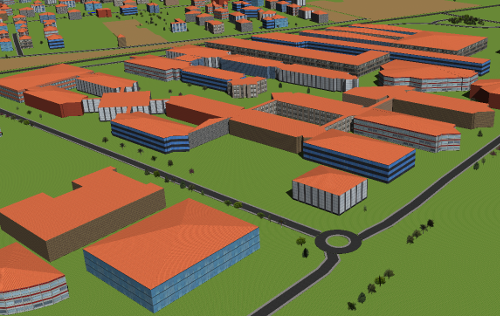

## Scenario creation tutorial

This small tutorial explains step-by-step how to create a scenario inspired from a real world map and then add traffic using SUMO.

### Download the map

We will use a part of the OpenStreetMap map to generate the Webots world file. To download the map go to the [OpenStreetMap website](https://www.openstreetmap.org/export). From there you can select the part of the map you want and download it:

%figure "Export a part of map from OpenStreetMap"

%end

### Generate the Webots world

As explained in the [OpenStreetMap importer](openstreetmap-importer.md) section, you should use the previously downloaded map to generate the Webots world.

> **note**:
This importer uses splines to improve and smooth the path of the roads, unfortunately the OpenStreetMap to SUMO importer does not support this, it is therefore recommended to disable it (setting the spline subdivision to 0) if you want then to add traffic using SUMO.

> **note**:
It is strongly recommended to not use the 3D feature of the [OpenStreetMap importer](openstreetmap-importer.md) otherwise it will not be possible to add traffic using SUMO.

Once the conversion is complete, the importer will display the number of objects generated, the map offset and reference coordinates:
```
 * map centered with this offset: x_offset_value,y_offset_value.
 * reference coordinates: latitude_value,longitude_value.
```
It is important that you keep these offset and reference coordinates since you will need to reuse them to generate traffic with SUMO.

From now you should be able to open the generated world file directly in Webots:

%figure "resulting world generated by the importer"



%end


### Generate the SUMO network files

We can also use the previously downloaded map to generate the SUMO network file. You need to use the [netconvert](http://sumo.dlr.de/wiki/NETCONVERT) utility for this:
```
netconvert --osm-files map.osm -o sumo.net.xml --geometry.remove --roundabouts.guess --ramps.guess --junctions.join --osm.railway.oneway-default --tls.guess-signals --tls.discard-simple --tls.join --proj "+proj=robin +lon_0=longitude_value +lat_0=latitude_value +x_0=0 +y_0=0 +ellps=WGS84 +units=m +no_defs"
```

> **note**:
You will have to replace `map.osm` by the real name of your map and `longitude_value` and `latitude_value` by the values displayed previously by the [OpenStreetMap importer](openstreetmap-importer.md).

Both the [OpenStreetMap importer](openstreetmap-importer.md) and [netconvert](http://sumo.dlr.de/wiki/NETCONVERT) will center the map, but it can happen that the centering is not perfectly matching and results in an offset between the Webots world and the SUMO network. To fix this problem, simply open the `sumo.net.xml` in a text editor and look for the line starting by `<location netOffset=` (it should be at the beginning of the file). You will need to change the value of the `netOffset` field, the new value (for each component) should be the previous value additioned to the value of `x_offset_value` and `y_offset_value` displayed by the [OpenStreetMap importer](openstreetmap-importer.md).

You can then generate the route file, SUMO provides several ways to generate route files. You may for example generate a [flow file](http://sumo.dlr.de/wiki/Definition_of_Vehicles,_Vehicle_Types,_and_Routes) and then use [duarouter](http://sumo.dlr.de/wiki/DUAROUTER) to generate the route file for you:
```
duarouter --flows sumo.flow.xml --net-file sumo.net.xml --output-file sumo.rou.xml
```

Finally you need to write the [SUMO configuration file](http://sumo.dlr.de/wiki/SUMO-GUI#Configuration_Files), the file should be called `sumo.sumocfg` and looks like this:
```
<?xml version="1.0" encoding="UTF-8"?>
<configuration xmlns:xsi="http://www.w3.org/2001/XMLSchema-instance" xsi:noNamespaceSchemaLocation="http://sumo.dlr.de/xsd/sumoConfiguration.xsd">
    <input>
        <net-file value="sumo.net.xml"/>
        <route-files value="sumo.rou.xml"/>
    </input>
    <time>
        <begin value="0"/>
    </time>
    <report>
        <verbose value="true"/>
        <no-step-log value="true"/>
    </report>
</configuration>
```

### Add the SUMO interface

Now that have all the required files, you can open the generated world in Webots and add the `SumoInterface` PROTO (or a `Supervisor` node and associate the `sumo_supervisor` controller to it). Since the network files are already generated, you need to set the `useNetconvert` field to FALSE (or use the `--noNetconvert` option) and set in the `networkfiles` field (or use the `--d or --directory` option) the path to the directory where the SUMO network files are located.
