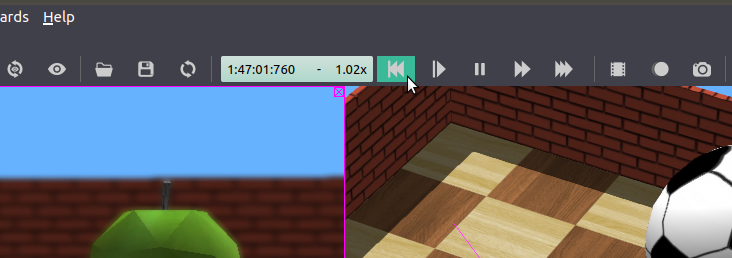

# Version R2018b Released

By Tom Norton - xxth June 2018

---

Today we're happy to announce the release of the all-new Webots 2018b, packed with some great new features.
As always, for a comprehensive list of changes please refer to the ChangeLog, found [here](https://www.cyberbotics.com/dvd/common/doc/webots/ChangeLog.html).

## WREN: Webots Renderer

For the past decade, Webots has used the [Object-Oriented Graphics Rendering Engine](https://www.ogre3d.org/) (OGRE) to handle 3D rendering. 
We encountered many roadblocks with OGRE and as such decided that it was better for us to implement our own bespoke rendering engine, from scratch.
This allows us to implement and use only the features we need / desire, giving us a very lightweight and efficient renderer.
We've spent the past year doing just this, and are proud to present our own bespoke OpenGL 3.3 based renderering engine, WREN (Webots RENderer).
Thus, Webots R2018b and all future versions of Webots will make use of WREN for all 3D work.

### Lightning Fast

As a result of implementing only what we need, and focusing on using modern techniques introduced with OpenGL 3+, Webots with WREN is much faster than with OGRE.
OGRE 1.9 (the version we used) is a CPU-bound renderer, which is bad news for Webots, which is optimised for single-thread performance.
Ideally, a 3D renderer for use with Webots should be GPU bound, and be as CPU-overhead minimal as possible, to provide "room" for the simulation's CPU-sided simulation workload (robot controllers, physics, GUI) as possible.
WREN is extremely CPU-light, and is GPU-bound for rendering.
This has allowed us to improve world performance considerably.
To illustrate this in practical terms, the simulation speedometer in "Run" mode is used as our performance indicator, to show the real-life implications of faster rendering in a Webots Simulation.
The following benchmarks were made on Windows 10, 64-bit with an Intel 6700k processor @ 3.40GHz and an NVIDIA GTX 970 graphics cards on some familiar webots worlds.

### Physically-Based Rendering

%figure "A model of a telephone, from the GLTF sample library."

%end

---

## New Look and Feel

### New Themes

%figure "Webots Night, The new default theme for Webots"

%end

We've done lots of work on user experience with this latest update. 
Shown above is the new default look for Webots R2018b, Webots Night.
This new look features clean lines, flat design, and a subdued color palette with highlights in just the right places to make interacting with Webots even more intuitive.
If you prefer the old look, we've also kept the previous style, in a theme called "Webots Classic".
There's also a more vibrant dark theme named "Webots Dusk".
Additionally, the splash screen has been re-designed to match our new themes.

### It's All About Context

We've wanted to streamline actions normally undertaken during normal simulation design workflow. 
These include editing a robot's controller, seeing a robot's window, deleting an object from the scene, etc.
So, to improve this, we've added a context menu to the 3D view and Scene Tree!

%figure "A Typical Context Menu for a Selected Robot Node"

%end

The menu adapts to the currently selected tree item or object in the 3D view, providing selection-specific actions and options.

Boot up Webots R2018b and have an explore of these new GUI features!

---

## Simulation Reset

Reloading an entire world just to re-run your simulation can be slow, espeically for large worlds.
With this in mind, we have developed an alternative method of resetting a simulation, and our terminology has changed as such.
"Revert" has become "Reload" and now users can benefit from the new "Reset Simulation" action, also accessible via the Supervisor API.

%figure "Reset Simulation Action"

%end

This feature makes resetting even the most complex simulations instantaneous.

---

## New PROTOs

---

## Extra Goodies

Webots R2018b supports Ubuntu 18.04 LTS out of the box.

The Speaker API can now load and play all major audio formats.

Added the possibility to set an empty string as Robot controller instead of the void controller to speed up simulation of non-controlled Robot nodes.

Projection mode, rendering mode, optional renderings and disable selection are now saved per world instead of globally.
