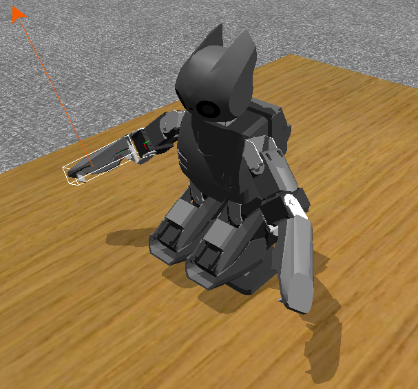

## Symmetry

This example is very basic and explains the use of the servos.

%figure "Symmetry example"



%end

It starts by setting the motor force of the three servos of the right arm to
zero in order to completely release this arm. Then, in an infinite loop, the
position of the previous three servos is read and displayed. Finally, still in
the loop, the opposite position of each servo of the right arm is applied to the
corresponding servo of the left arm in order to mimic the motion of the right
arm. In order to move the right arm which is free in simulation, select the
robot, then press Ctrl+Alt and left click on the arm, then without releasing the
left button move the mouse. This will apply a force (symbolized by an arrow)
which will make the arm move. Note that it is very important to activate the
position feedback of the servos in order to read their position. In this
example, this is done in the constructor.

You can also try to add an oscillation of the head, by adding this in your main
loop:

``` c
mServos[18]->setPosition(sin(getTime()));
```

Then save the file, press the build button and finally revert the simulation to
start the new controller. This example is well suited for the cross-compilation
and we recommended that you start by testing the cross-compilation tool by using
this example.

