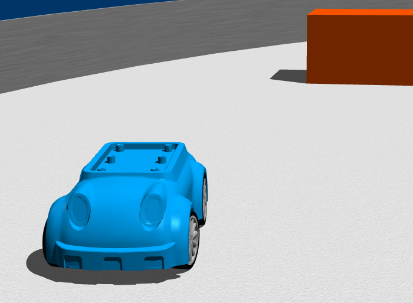

## Saeon's ALTINO

%figure "ALTINO model in Webots"


%end

The "ALTINO System" is a robot platform designed for education.
It is a four-wheeled robot based on an Ackermann vehicle frame.
It contains many sensors including infrared sensors, a compass and an accelerometer.
More information on the [constructor website](https://www.saeon-altino.com).

### Altino PROTO

```
Altino {
  SFVec3f    translation     0 0.016 0
  SFRotation rotation        0 1 0 1.5708
  SFString   name            "vehicle"
  SFString   controller      "vehicle_driver_altino"
  SFString   controllerArgs  ""
  SFBool     synchronization TRUE
  SFColor    color           0.3 0.3 0.7
}
```

> **File location**: "WEBOTS\_HOME/projects/robots/saeon/protos/Altino.proto"

#### Altino Field Summary

- `translation`: Inherited from [Transform](../reference/transform.md) node.

- `rotation`: Inherited from [Transform](../reference/transform.md) node.

- `name`: Inherited from [Solid](../reference/solid.md) node.

- `controller`: Inherited from [Robot](../reference/robot.md) node.

- `controllerArgs`: Inherited from [Robot](../reference/robot.md) node.

- `synchronization`: Inherited from [Robot](../reference/robot.md) node.

- `color`: Inherited from [Material](../reference/material.md) node.

### Samples

You will find the following example in this folder: "WEBOTS\_HOME/projects/robots/saeon/worlds".

#### altino.wbt

 This simulation shows the ALTINO model in a simple environment.
The ALTINO controller, written in Python, shows a collision avoidance behavior based on a Braitenberg vehicle.
Alternatively, the vehicle can be controlled manually using the computer keyboard.
Please refer to the Webots console to learn the control keys.
