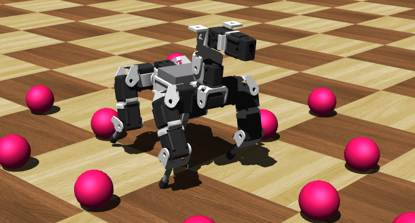

## Robotis's Bioloid

%figure "A Bioloid dog-like model in Webots"


%end

The [Bioloid Comprehensive Kit](https://en.wikipedia.org/wiki/Robotis_Bioloid) allows to create articulated robots.
This kit is developed by [Robotis](http://www.robotis.com).

This page shows a dog-like robot built with the Bioloid kit, and its model in Webots (cf. [this figure](#comparison-of-a-real-bioloid-dog-like-robot-and-its-webots-model)).
Both the visual aspect and the physical properties of the real robot have been modeled.
The physical dimensions, friction coefficients and mass distribution have been estimated after various measurements on the components of the real robot.

%figure "Comparison of a real Bioloid dog-like robot and its Webots model"


%end

### Movie Presentation


### BioloidDog PROTO

```
BioloidDog {
  SFVec3f    translation     0 0 0
  SFRotation rotation        0 1 0 0
  SFString   name            "BioloidDog"
  SFString   controller      "bioloid_dog"
  SFString   controllerArgs  ""
  SFString   customData      ""
  SFBool     synchronization TRUE
  MFNode     extensionSlot   []
}
```

> **File location**: "WEBOTS\_HOME/projects/robots/robotis/bioloid/protos/BioloidDog.proto"

#### BioloidDog Field Summary

- `translation`: Inherited from [Transform](../reference/transform.md) node.

- `rotation`: Inherited from [Transform](../reference/transform.md) node.

- `name`: Inherited from [Solid](../reference/solid.md) node.

- `controller`: Inherited from [Robot](../reference/robot.md) node.

- `controllerArgs`: Inherited from [Robot](../reference/robot.md) node.

- `customData`: Inherited from [Robot](../reference/robot.md) node.

- `synchronization`: Inherited from [Robot](../reference/robot.md) node.

- `extensionSlot`: Extends the robot with new nodes in the extension slot.

### Samples

You will find the following sample in this folder: "WEBOTS\_HOME/projects/robots/robotics/bioloid/worlds".

#### bioloid.wbt

 In this example, the dog-like robot model walks on a flat floor.

Using the keyboard, the user can control the quadruped robot by setting the walking direction (forward or backwards) and also the heading direction (right or left).
Keyboard actions include:

- `Right Arrow`: Turn right.
- `Left Arrow`: Turn left.
- `B`: Walk backwards.
- `F`: Walk forward.

The walking gait used in the controller relies on an inverse kinematics model.
Further details are available from [BIRG website](http://birg.epfl.ch/page66584.html).
The included controller illustrates a trotting gait showing the best performance so far.
The turning capabilities of the robot are based on the stride length modulation.
When the robot is asked to turn right, the stride length of the right side and left side are respectively decreased and increased.
During the walk, the extremity of each leg is describing an ellipsoid, the diameters of these ellipsoids are updated according to the stride length to allow the robot to turn either right or left.

Other keyboard actions are also provided to fine-tune the frequency and the stride length factor:

- `Q`: Increase frequency.
- `W`: Decrease frequency.
- `S`: Increase stride length factor.
- `A`: Decrease stride length factor.
