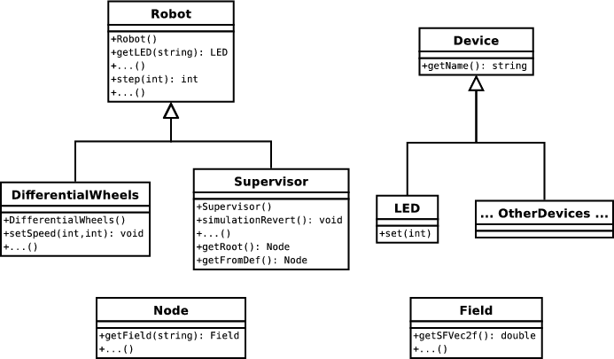

## C++/Java/Python

This section explains the main differences between the C API and the
C++/Java/Python APIs.

### Classes and Methods

C++, Java and Python are object-oriented programming languages and therefore the
corresponding Webots APIs are organized in classes. The class hierarchy is built
on top of the C API and currently contains about 25 classes and 200 methods
(functions).

The Java and Python APIs are automatically generated from the C++ API using
SWIG. Therefore the class and method names, as well as the number of parameters
and their types, are very similar in these three languages.

%figure "Webots APIs Overview"


%end

The naming convention of the C++/Java/Python classes and methods directly
matches the C API function names. For example, for this C function: `double
wb_distance_sensor_get_value(WbDeviceTag tag)` there will be a matching
C++/Java/Python method called `getValue()` located in a class called
`DistanceSensor`. Usually the C++/Java/Python methods have the same parameters
as their C API counterparts, but without the `WbDeviceTag` parameter.

### Controller Class

The C++/Java/Python controller implementation should be placed in a user-defined
class derived from one of the Webots class: `Robot, DifferentialWheels` or
`Supervisor`. It is important that the controller class is derived from the same
class as that used in Scene Tree, otherwise some methods may not be available or
may not work. For example, if in the Scene Tree a robot is of type
`DifferentialWheels`, then the corresponding C++/Java/Python controller class
must extend the `DifferentialWheels` class. If in the Scene Tree a robot is of
type `Supervisor`, then the C++/Java/Python controller class must be derived
from the `Supervisor` class, etc.

As you can see in [this figure](#a-small-subset-of-webots-oriented-object-apis),
both `DifferentialWheels` and `Supervisor` are subclasses of the `Robot` class.
Hence it is possible to call the `Robot`'s methods, such as, e.g., `step()` or
`getLED()`, from the `DifferentialWheels` and `Supervisor` controllers. But it
is not possible to call the `Supervisor` methods from a `DifferentialWheels`
controller, and vice versa. For example it won't be possible to call
`simulationRevert()` from a `DifferentialWheels` controller.

%figure "A small subset of Webots oriented-object APIs"



%end

Generally, the user-defined controller class should have a `run()` function that
implements the main controller loop. That loop should contains a call to the
`Robot`'s `step()` method. Then the only responsibility of the controller's
`main()` function is to create an instance of the user-defined controller class,
call its `run()` method and finally delete (C++ only) the instance: see examples
below. Note that the controller should never create more than one instance of a
derived class, otherwise the results are undefined.

Note that unlike the C API, the C++/Java/Python APIs don't have (and don't need)
functions like `wb_robot_init()` and `wb_robot_cleanup()`. The necessary
initialization and cleanup routines are automatically invoked from the
constructor and destructor of the base class.

In C++/Java/Python, each Webots device is implemented as a separate class, there
is a `DistanceSensor` class, a `TouchSensor` class, a `RotationalMotor` class,
etc. The various devices instances can be obtained with dedicated methods of the
`Robot` class, like `getDistanceSensor(), getTouchSensor()`, etc. There is no
`WbDeviceTag` in C++/Java/Python.

### C++ Example

``` c
#include <webots/Robot.hpp>
#include <webots/LED.hpp>
#include <webots/DistanceSensor.hpp>

using namespace webots;

#define TIME_STEP 32

class MyRobot : public Robot {
  private:
    LED *led;
    DistanceSensor *distanceSensor;

  public:
    MyRobot() : Robot() {
      led = getLED("ledName");
      distanceSensor = getDistanceSensor("distanceSensorName");
      distanceSensor->enable(TIME_STEP);
    }

    virtual ~MyRobot() {
      // Enter here exit cleanup code
    }

    void run() {
      // Main control loop
      while (step(TIME_STEP) != -1) {
        // Read the sensors
        double val = distanceSensor->getValue();

        // Process sensor data here

        // Enter here functions to send actuator commands
        led->set(1);
      }
    }
};

int main(int argc, char **argv) {
  MyRobot *robot = new MyRobot();
  robot->run();
  delete robot;
  return 0;
}
```

### Java Example

```
import com.cyberbotics.webots.controller.*;

public class MyRobot extends Robot {
  private LED led;
  private DistanceSensor distanceSensor;
  private static final int TIME_STEP = 32;  // milliseconds

  public MyRobot() {
    super();
    led = getLED("my_led");
    distanceSensor = getDistanceSensor("my_distance_sensor");
    distanceSensor.enable(TIME_STEP);
  }

  public void run() {
    // main control loop
    while (step(TIME_STEP) != -1) {
      // Read the sensors, like:
      double val = distanceSensor.getValue();

      // Process sensor data here

      // Enter here functions to send actuator commands, like:
      led.set(1);
    }

    // Enter here exit cleanup code
  }

  public static void main(String[] args) {
    MyRobot robot = new MyRobot();
    robot.run();
  }
}
```

### Python Example

```
from controller import *

class MyRobot (Robot):
  def run(self):
    led = self.getLed('ledName')
    distanceSensor = self.getDistanceSensor('distanceSensorName')
    distanceSensor.enable(32)

    while (self.step(32) != -1):
      # Read the sensors, like:
      val = distanceSensor.getValue()

      # Process sensor data here

      # Enter here functions to send actuator commands, like:
      led.set(1)

    # Enter here exit cleanup code

robot = MyRobot()
robot.run()
```

