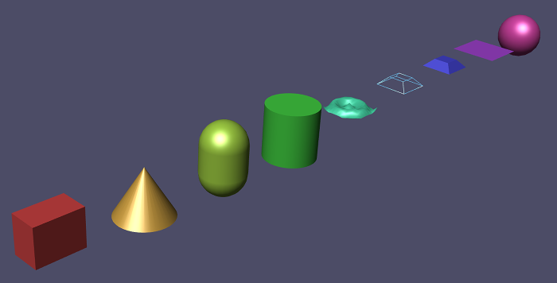
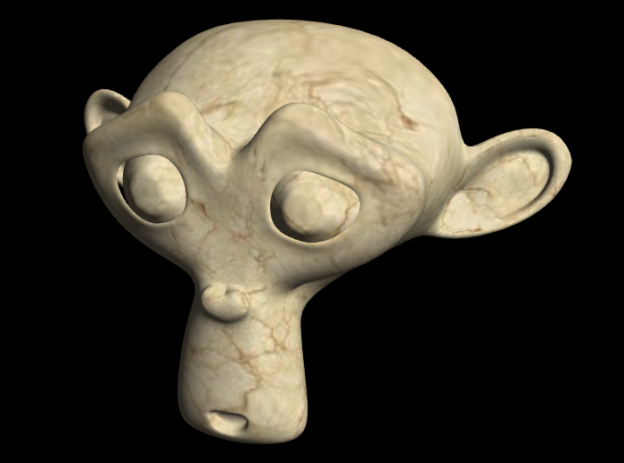
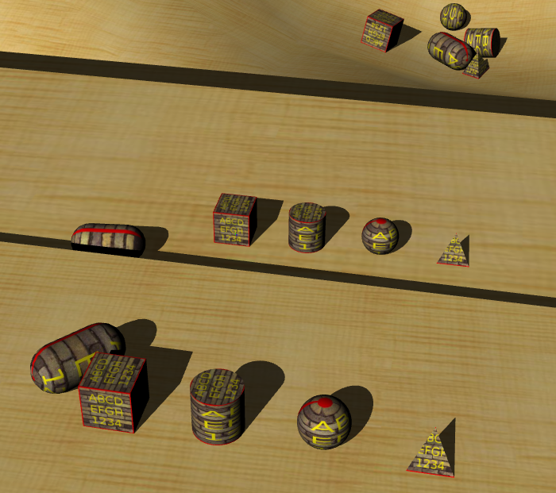
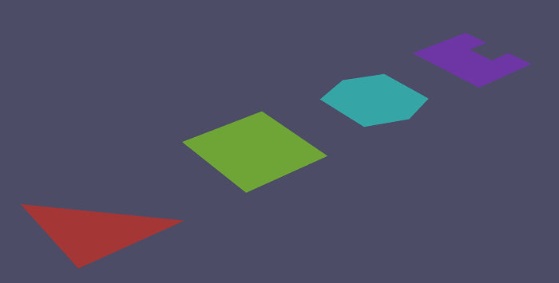
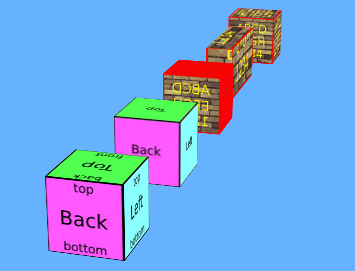
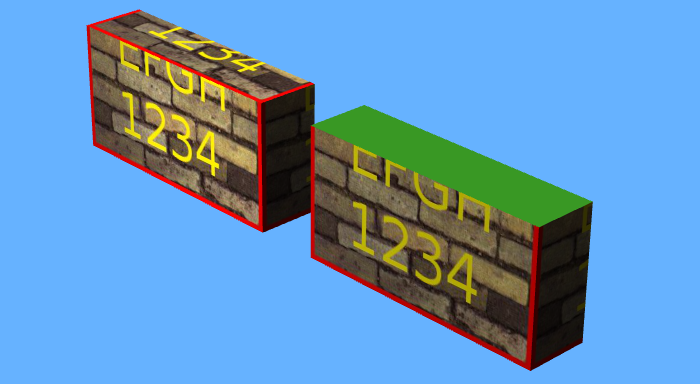

## Geometries

This section shows the geometric primitives available in Webots.
The world files for these examples are located in the "sample/geometries/worlds" directory.

In this directory, you will find the following world files :

### extended\_solids.wbt

**Keywords**: Extended solids, torus, rounded box, pipe

 This example demonstrates the use of several extended primitives.
These compound primitives are created using procedural PROTO nodes that generate a set of basic Geometry nodes.

In this example, physics laws are applied on these primitives.

### extrusion.wbt

**Keywords**: Extrusion

 This example demonstrates the use of the `Extrusion` PROTO.
The `Extrusion` PROTO is a procedural PROTO which generates an `IndexedFaceSet` node.
The `Extrusion` PROTO fields allow to define a 2D cross-section, and to extrude it along a path.
In this example, the cross-section is a triangle extruded along a spiral path.

### floating\_geometries.wbt

**Keywords**: Fluid simulation

 This example demonstrates the interactions between basic physics primitives and fluids.
Three `Fluids` nodes are present; two flowing fluids to simulate a river, and a static fluid to simulate a cylindric pool.
The small `Solids` are affected by the fluids' viscosity and by forces generated on the [Archimedes' principle](https://en.wikipedia.org/wiki/Archimedes%27_principle).

### geometric\_primitives.wbt

**Keywords**: Box, Capsule, Cone, Cylinder, ElevationGrid, IndexedLineSet, IndexedFaceSet, Plane, Sphere

 This example demonstrates the geometric primitives natively supported in Webots.
The primitives are inserted into `Transform` and `Shape` nodes.
Therefore they are static, i.e. physics is not applied on them.

### high\_resolution\_indexedfaceset.wbt

**Keywords**: IndexedFaceSet, High resolution mesh

 This example simply displays a high resolution mesh.
This mesh is a textured high resolution version of the [Blender's mascot, Suzanne](https://en.wikipedia.org/wiki/Blender_(software)#Suzanne).
It is composed of 8000 triangles with UV mapping.
It has been imported from [Blender](https://www.blender.org/).

### muscle.wbt

**Keywords**: Muscle

 This example demonstrates how to use the `Muscle` node.
The `Muscle` nodes complete the joints by visualizing colored capsule-like shapes.

Two scenarios are shown:

1. Two muscles are applied on a `HingeJoint` node.
Depending on the joint motion, one muscle is contracted, and the other one is released.
2. A muscle is applied on a `SliderJoint` node.

### physics\_primitives.wbt

**Keywords**: Collisions, physics primitives

 This example demonstrates a large set of the possible collisions between the basic physics primitives.
Three identical sets of primitives composed of `Box`, a `Capsule`, a `Cylinder`, a `Sphere` and an `IndexedFaceSet` nodes fall onto three surfaces respectively; a `Box`, a `Plane` and an `ElevationGrid` node.

### polygons.wbt

**Keywords**: IndexedFaceSet, polygon tesselation

 This example shows the polygon tesselation feature.
Four polygons are displayed: a simple triangle, a quad, a convex polygon (hexagon), and a non-convex polygon.
Each polygon is modeled as a list of vertices.
Webots applies a tesselation algorithm on this list, and creates the minimum number of OpenGL triangles.
The triangles can be shown using the `View / Wireframe Rendering` menu item.

### textured\_boxes.wbt

**Keywords**: TexturedBox, texture mapping

 This example shows the possible UV mappings for the `TexturedBox` PROTO.

### textured\_proto\_shapes.wbt

**Keywords**: TexturedBoxShape, texture mapping

 This example shows the differences between the `TexturedBoxShape` and `TexturedBoxShape` PROTO nodes.

### textured\_shapes.wbt

**Keywords**: Texture mapping

 This example shows how textures are applied on basic primitives.
The same `Appearance` node is applied on all the basic primitives following VRML rules about texture mapping.

### webots\_box.wbt

**Keywords**: IndexedFaceSet, UV mapping

 This example shows how the Webots
