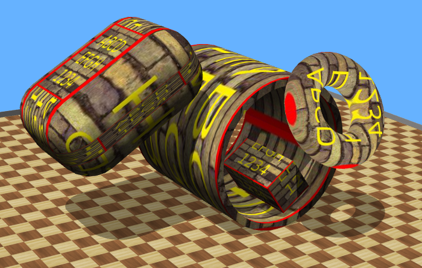
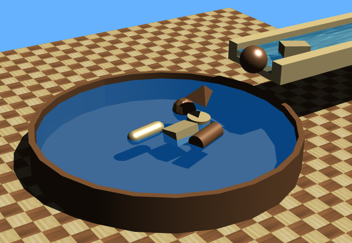

## Geometries

This section shows the geometric primitives available in Webots.
The world files for these examples are located in the "sample/geometries/worlds" directory.

In this directory, you will find the following world files :

### box.wbt, capsule.wbt, cone.wbt, convex\_polygon.wbt, cylinder.wbt, polyhedra.wbt, sphere.wbt

**Keywords**: Box, Capsule, Cone, Cylinder, Sphere, IndexedFaceSet, basic 3D primitives

These examples shows how to use the basic geometric primitives of Webots in order to display untextured and colored 3D shapes in the 3D window.
No physics is running in this example.
Basically:

- `box.wbt` demonstrates how to use the `Box` primitive to display a red box.
- `capsule.wbt`: demonstrates how to use the `Capsule` primitive to display a red capsule.
- `cone.wbt`: demonstrates how to use the `Cone` primitive to display a red cone.
- `convex_polygon.wbt`: demonstrates how to use the `IndexedFaceSet` primitive to display a convex polygon.
- `cylinder.wbt`: demonstrates how to use the `Cylinder` primitive to display a red cylinder.
- `polyhedra.wbt`: demonstrates how to use the `IndexedFaceSet` primitive to display a red polyhedra.
- `sphere.wbt`: demonstrates how to use the `Sphere` primitive to display a red sphere.

### extended\_solids.wbt

**Keywords**: Extended solids, torus, rounded box, pipe

 This example demonstrates the use of several extended primitives.
These primitives are based on the basic Geometry nodes, and are defined as PROTO.
Physics is running in this example.

### extrusion.wbt

**Keywords**: Extrusion

 This example demonstrates the use of the `Extrusion` PROTO.
The `Extrusion` PROTO allows to define a 2D section shape, and to extrude it along a path.
In this example, the section is a triangle extruded along a spiral path.

### floating\_geometries.wbt

**Keywords**: Fluid simulation

 This examples demonstrates the interactions between basic physics primitives and fluids.
Three geometries are `Fluid` (two flowing fluids and a static pool).
Therefore the other small objects are affected by the fluids viscosity and forces based on the Archimedes' principle.

### high\_resolution\_indexedfaceset.wbt

TODO.

### muscle.wbt

TODO.

### non\_convex\_polygon.wbt

TODO.

### physics\_primitives.wbt

TODO.

### textured\_boxes.wbt

TODO.

### textured\_proto\_shapes.wbt

TODO.

### textured\_shapes.wbt

TODO.

### webots\_box.wbt

TODO.
