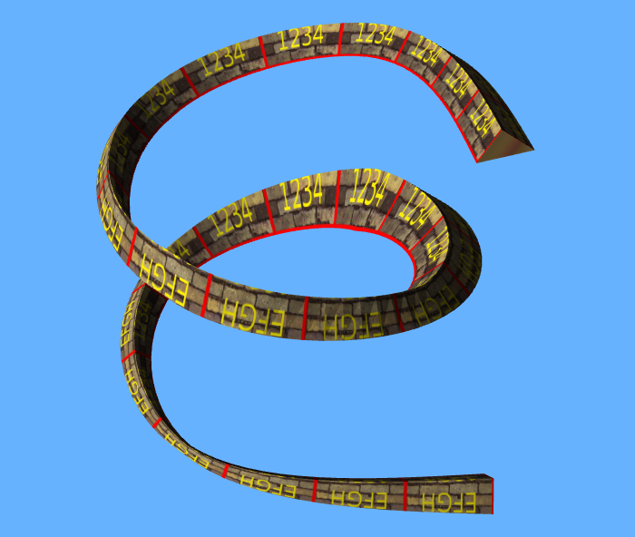
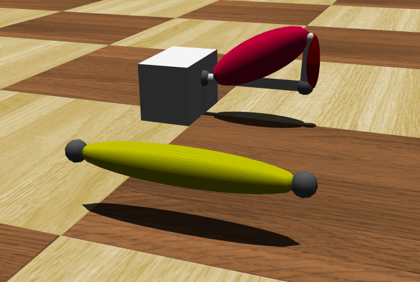
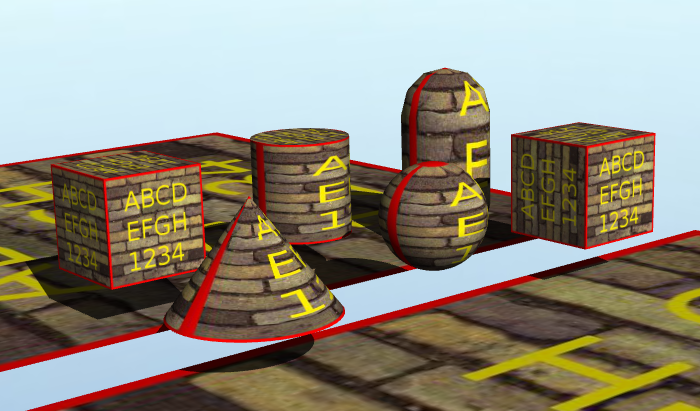
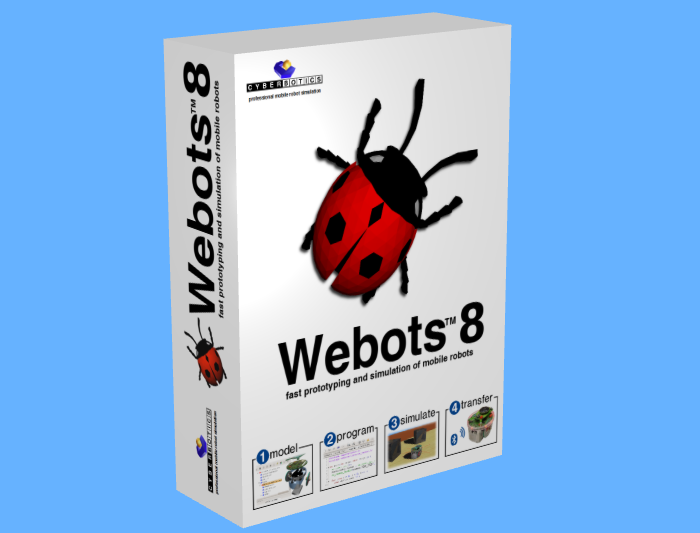

## Geometries

This section shows the geometric primitives available in Webots.
The world files for these examples are located in the "sample/geometries/worlds" directory.

In this directory, you will find the following world files :

### box.wbt, capsule.wbt, cone.wbt, convex\_polygon.wbt, cylinder.wbt, non\_convex\_polygon.wbt, polyhedra.wbt, sphere.wbt

**Keywords**: Box, Capsule, Cone, Cylinder, Sphere, IndexedFaceSet, basic 3D primitives

These examples show how to use the basic geometric primitives of Webots in order to display untextured and colored 3D shapes in the 3D window.
The primitives are static in this example, i.e. physics is not applied on them.
Basically :

- `box.wbt` demonstrates how to use the `Box` node to display a red box.
- `capsule.wbt`: demonstrates how to use the `Capsule` node to display a red capsule.
- `cone.wbt`: demonstrates how to use the `Cone` node to display a red cone.
- `convex_polygon.wbt`: demonstrates how to use the `IndexedFaceSet` node to display a convex polygon.
- `cylinder.wbt`: demonstrates how to use the `Cylinder` node to display a red cylinder.
- `polyhedra.wbt`: demonstrates how to use the `IndexedFaceSet` node to display a red polyhedra.
- `sphere.wbt`: demonstrates how to use the `Sphere` node to display a red sphere.

### extended\_solids.wbt

**Keywords**: Extended solids, torus, rounded box, pipe

 This example demonstrates the use of several extended primitives.
These compound primitives are created using procedural PROTOs generating a set basic Geometry nodes.
In this example, physics laws are applied on these primitives.

### extrusion.wbt

**Keywords**: Extrusion

 This example demonstrates the use of the `Extrusion` PROTO.
The `Extrusion` PROTO in a procedural PROTOs generating an `IndexedFaceSet` node.
The `Extrusion` PROTO fields allow to define a 2D section, and to extrude it along a path.
In this example, the section is a triangle extruded along a spiral path.

### floating\_geometries.wbt

**Keywords**: Fluid simulation

 This example demonstrates the interactions between basic physics primitives and fluids.
Three `Fluids` nodes are present; two flowing fluids to simulate a river, and a static fluid to simulate a cylindric pool.
The small `Solids` are affected by the fluids viscosity and by forces generated on the [Archimedes' principle](https://en.wikipedia.org/wiki/Archimedes%27_principle).

### high\_resolution\_indexedfaceset.wbt

**Keywords**: IndexedFaceSet, High resolution mesh

 This example simply displays a high resolution mesh.
This mesh is a textured high resolution version of the [monkey head of Blender](https://en.wikipedia.org/wiki/Blender_(software)#Suzanne).
It is composed of 8000 triangles with UV mapping.
It has been imported from [Blender](https://www.blender.org/).

### muscle.wbt

**Keywords**: Muscle

 This example demonstrates how to use the `Muscle` node.
The `Muscle` nodes complete the joints by visualizing colored capsule-like shapes.

Two scenarios are shown:

1. Two muscles are applied on a `HingeJoint` node.
Depending on the joint move, one muscle is contracted, and the other one is released.
2. A muscle is applied on a `SliderJoint` node.

### physics\_primitives.wbt

**Keywords**: Collisions, physics primitives

 This example demonstrates a large set of the possible collisions between the basic physics primitives.
Three identical set of primitives composed of a `Box`, a `Capsule`, a `Cylinder`, a `Sphere` and an `IndexedFaceSet` nodes fall over three grounds, respectively, a `Box`, a `Plane` and an `ElevationGrid` node.

### textured\_boxes.wbt

**Keywords**: TexturedBox, texture mapping

 This example shows the possible UV mappings for the `TexturedBox` PROTO.

### textured\_proto\_shapes.wbt

**Keywords**: TexturedBoxShape, texture mapping

 This example shows the differences between the `TexturedBoxShape` and `TexturedBoxShape` PROTOs.

### textured\_shapes.wbt

**Keywords**: Texture mapping

 This example shows how textures are applied on the basic primitives.
The same `Appearance` node is applied on all the basic primitives following the VRML rules about texture mapping.

### webots\_box.wbt

**Keywords**: IndexedFaceSet, UV mapping

 This example shows how the Webots box can be modeled using an `IndexedFaceSet` node and texture mapping.
