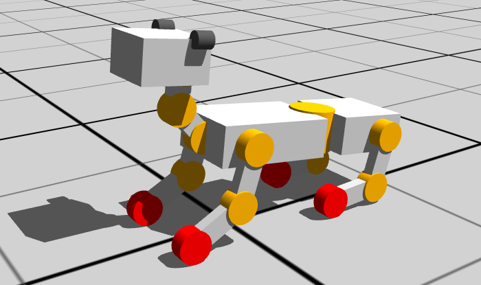

## Biorob Ghostdog

%figure "Ghostdog model in Webots"

%end

TODO: description.

### Samples

You will find the following sample in this folder: "WEBOTS\_HOME/projects/robots/epfl/biorob/worlds".

#### ghostdog.wbt

 This example shows a galloping quadruped robot made of active hip joints and passive knee joints (using springs and dampers).
The keyboard can be used to control the robot's direction and to change the amplitude of the galloping motion.
Each knee is made of two embedded HingeJoint nodes, one active and one passive, sharing the same rotation axis.
The passive HingeJoint simulates the spring and damping.
The active HingeJoint is not actuated in this demo but it could be used for controlling the knee joints.
