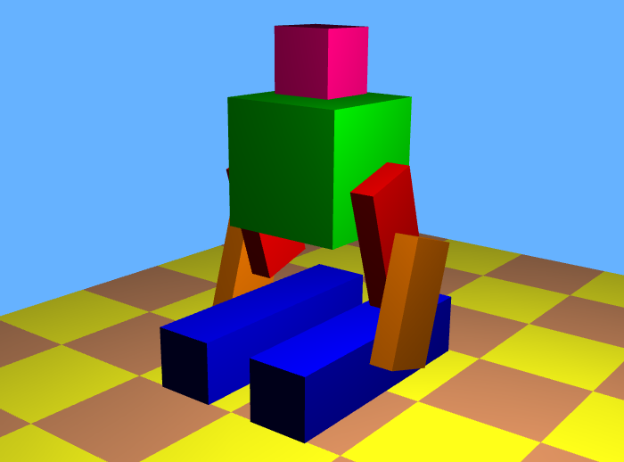
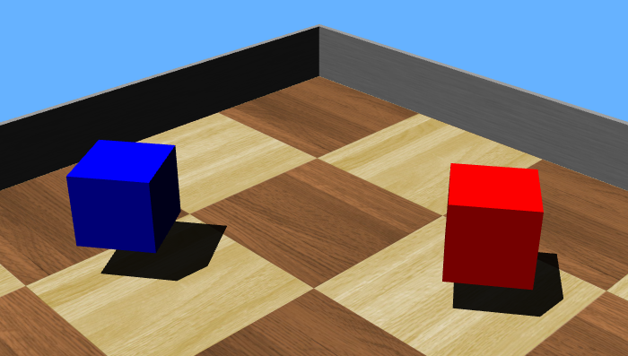

## How To

This section gives various examples of complex behaviors and/or functionalities.
The world files are located in the "WEBOTS\_HOME/projects/samples/howto/worlds" directory, and their controllers in the "WEBOTS\_HOME/projects/samples/howto/controllers" directory.
For each, the world file and its corresponding controller are named according to the behavior they exemplify.

### asymmetric_friction1.wbt

TODO

### asymmetric_friction2.wbt

TODO

### binocular.wbt

**Keywords**: Stereovision, Stereoscopy, Camera

%figure "binocular"

%end

This example simply shows how to equip a robot with two `Camera`s for
stereovision. The example does not actually perform stereovision or any form of
computer vision.

### biped.wbt

**Keywords**: Humanoid robot, biped robot, power off, passive joint

%figure "biped"

%end

In this example, a biped robot stands up while his head rotates. After a few
seconds, all the motors are turned off and the robot collapses. This example
illustrates how to build a simple articulated robot and also how to turn off
motor power.

### center_of_mass.wbt

TODO

### contact_points.wbt

TODO

### cylinder_stack.wbt

TODO

### force_control.wbt

**Keywords**: Force control, linear motor, spring and damper

%figure "force_control"

%end

This world shows two boxes connected by a `LinearMotor`. Here, the purpose is to
demonstrate the usage of the `wb_motor_set_force()` function to control a
`LinearMotor` with a user specified force. In this example,
`wb_motor_set_force()` is used to simulate the effect of a spring and a damper
between the two boxes. When the simulation starts, the motor force is used to
move the boxes apart. Then, the motor force is turned off and the boxes oscillate for
a while according to the spring and damping equations programmed in the
controller.

### force_control.wbt

TODO

### four_wheels.wbt

TODO

### gui_tracker.wbt

TODO

### inverted_pendulum.wbt

**Keywords**: Inverted pendulum, PID, LinearMotor

%figure "inverted_pendulum"

%end

In this example, a robot moves from left to right in order to keep an inverted
pendulum upright. This is known as the "Inverted Pendulum Problem", and it is
solved in our example by using a PID (Proportional Integral Differential)
controller.

### mouse_events.wbt

TODO

### omni_wheels.wbt

TODO

### passive_dynamic_walker.wbt

TODO

### pedal_racer.wbt

TODO

### physics.wbt

**Keywords**: Physics plugin, OpenGL drawing, flying robot, Emitter, Receiver

%figure "physics"

%end

In this example, a robot flies using a physics plugin. This plugins is an
example of:

- how to access Webots objects in the physics plugin
- how to exchange information with the controller
- how to add custom forces
- how to move objects
- how to handle collisions
- how to draw objects using OpenGL

### rope.wbt

TODO

### sick_terrain_scanning.wbt

TODO

### texture_change.wbt

**Keywords**: Supervisor, texture, `wb_supervisor_field_set_*()`, Camera

%figure "texture_change"

%end

In this example, a robot moves forward and backward in front of a large textured
panel. The robot watches the panel with its `Camera`. Meanwhile a `Supervisor`
switches the image displayed on the panel.

### vision.wbt

TODO

### ziegler_nichols.wbt

TODO
