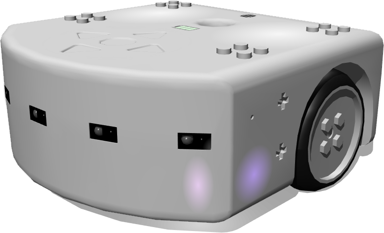
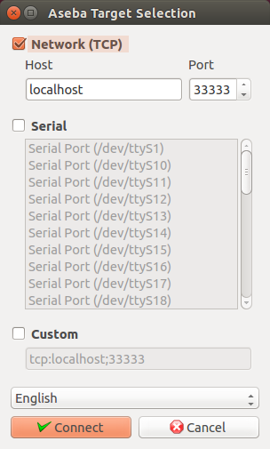
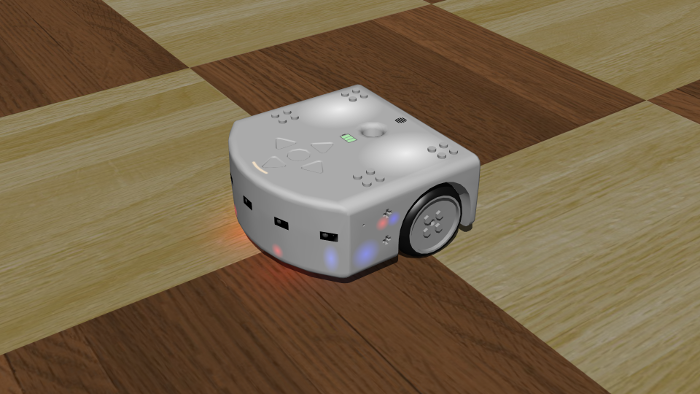
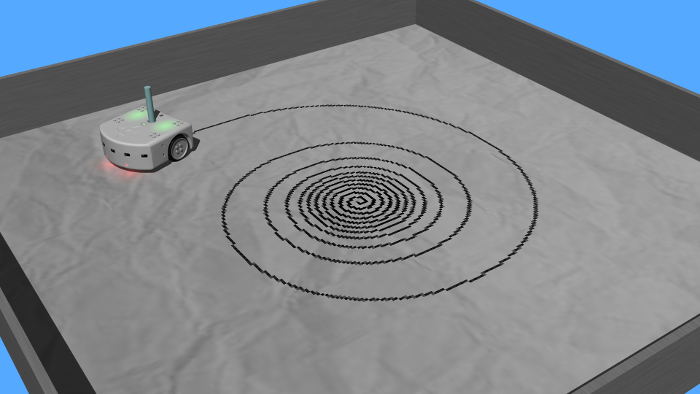
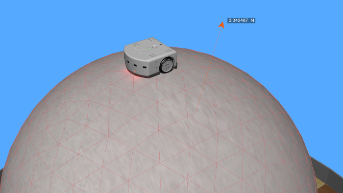

## Mosyba's Thymio II

%figure "Thymio II model in Webots"



%end

Thymio II is an affordable educational robot.
It provides three main features: a large number of sensors and actuators, an educative interactivity based on light and touch, a programming environment featuring graphical and text programming.

More information about the Thymio II is available from its official [website](https://aseba.wikidot.com/en:thymio).

Webots contains an accurate model of the Thymio II robot (see the [figure](#thymio-ii-model-in-webots)).
Almost all the Thymio II devices have been modeled and calibrated.
Moreover Aseba studio and VPL for Thymio II can be connected on the simulated model allowing you to program the simulated robot using Aseba.
Many Aseba examples are working directly with the simulated robot.
Finally several objects related to the Thymio II are available, including a pen which can draw on any 3D object.

### Movie Presentation


### Thymio II Model

The main characteristics of the Thymio II model in Webots is summed up in [this table](#thymio-ii-characteristics).

%figure "Thymio II characteristics"

| Characteristics             | Values       |
| --------------------------- | ------------ |
| Length                      | 112 mm       |
| Width                       | 117 mm       |
| Height                      | 53 mm        |
| Weight                      | 0.25 kg      |
| Max. forward/backward speed | 0.2 m/s      |
| Max. rotation speed         | 9.53 rad/s   |

%end

The following [table](#thymio-ii-devices) shows which devices are supported by the model, and their names (using the Webots terminology).

%figure "Thymio II devices"

| Device             | Support         | Webots name                                                                                                                               |
| ------------------ | --------------- | ----------------------------------------------------------------------------------------------------------------------------------------- |
| Motors             | Full support    | motor.[left-right]                                                                                                                        |
| RGB LEDs           | Full support    | leds.top, leds.bottom.[right-left]                                                                                                        |
| LEDs               | Full support    | leds.buttons.led[0-3], leds.circle.led[0-7], leds.prox.h.led[0-7], leds.prox.v.led[0-1], leds.sound, leds.rc, leds.temperature.[red-blue] |
| IR sensors         | Full support    | prox.horizontal.[0-6], prox.ground.[0-1]                                                                                                  |
| Accelerometer      | Full support    | acc                                                                                                                                       |
| Buttons            | Full support    | button.[forward-backward-left-right-center]                                                                                               |
| Microphone         | Clap event only | through the robot window                                                                                                                  |
| Speaker            | Not supported   | N/A                                                                                                                                       |
| Temperature sensor | Not supported   | N/A                                                                                                                                       |
| RC device          | Not supported   | N/A                                                                                                                                       |

%end

The Thymio II distance sensor feedback is given on [this figure](#proximity-sensor-response-versus-distance).
The calibration was performed using a regular A4 white paper.

%figure "Proximity sensor response versus distance"


%end

### Thymio2 PROTO

Derived from [Robot](../reference/robot.md).

```
Thymio2 {
  SFVec3f    translation     0 0 0
  SFRotation rotation        0 1 0 0
  SFString   name            "Thymio II"
  SFString   controller      "thymio2_aseba"
  SFString   controllerArgs  "port=33333"
  SFString   customData      ""
  SFBool     synchronization TRUE
  SFString   window          ""
  SFString   contactMaterial "thymio body"
  SFBool     castLight       TRUE
  MFNode     bodySlot        []
}
```

> **File location**: "WEBOTS\_HOME/projects/robots/mobsya/thymio/protos/Thymio2.proto"

#### Thymio2 Field Summary

- `contactMaterial`: Defines the [Solid](../reference/solid.md) for the body.

- `castLight`: Defines whether OpenGL lights are cerated for each LEDs.

- `bodySlot`: Extends the robot with new nodes in the body slot.

### Connect Aseba to the Thymio II Model

The default controller of the Thymio II PROTO is the `thymio2_demo` controller.
It should be changed to `thymio2_aseba` to allow the connection to Aseba programming environment.
However, most world files including the Thymio II robot are already configured to use `thymio2_aseba` as a controller for the Thymio II robot.
Technically, `thymio2_aseba` creates a TCP/IP server on which Aseba can be connected, and it wraps the Aseba API with the Webots API.

Here is how to proceed to connect Aseba to the Thymio II model in Webots.
Make sure that the simulation is running (the controller has started) and that the controller of the Thymio II robot is `thymio2_aseba`.
You can check this from the Webots scene tree, by opening the Thymio2 node.
Aseba Studio or VPL for Thymio II can then be started.
From the Aseba target selection dialog (see the [figure](#aseba-studio-and-vpl-target-selection-dialog).), select the `Network TCP/IP` option with the following parameters: `Host = localhost` and `Port = 33333`.
Then just click on the `Connect` button.

In case of a simulation containing several Thymio II, the TCP/IP port of the `thymio2_aseba` controller should be unique for each robot instance.
This value can be modified by editing the `Thymio2::controllerArgs` field.

%figure "Aseba Studio and VPL target selection dialog"



%end

The Thymio II window (see the [figure](#thymio-ii-robot-window)) can help you to raise some events easily.
These events are mainly useful when using the VPL for Thymio II software.
To open the Thymio II window, just double click on the 3D model of the robot.

%figure "Thymio II robot window"


%end

### Samples

Various examples of the possible behaviors of the Thymio II are located here: "WEBOTS\_HOME/projects/robots/mobsya/thymio/worlds".
The various accessible worlds are described below.

#### thymio2.wbt

 An example of the possible behaviors of the Thymio II.

#### thymio2\_pen.wbt

 You can easily add a pen in the simulated model by adding a `Thymio2Pen` node to the `Thymio2::bodySlot` field.
This pen can draw on every 3D object.
This is particularly useful to perform [these exercises](https://aseba.wikidot.com/en:thymiodrawing).


#### thymio2\_ball.wbt

 [These exercises](https://aseba.wikidot.com/en:thymioballeinverse) can be reproduced by adding a `Thymio2Ball` node in your world.
The ball can be slightly moved by applying a force on it (`ALT + mouse left click`).
