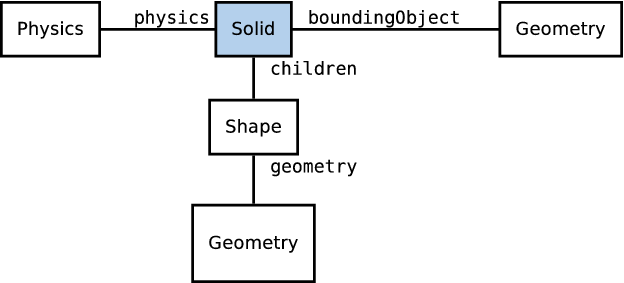
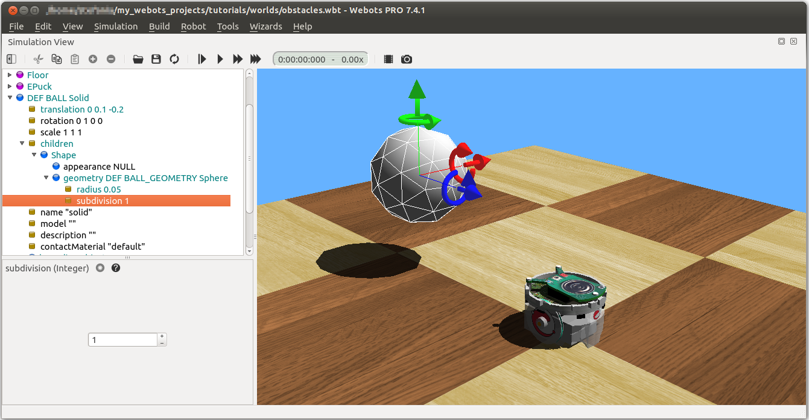
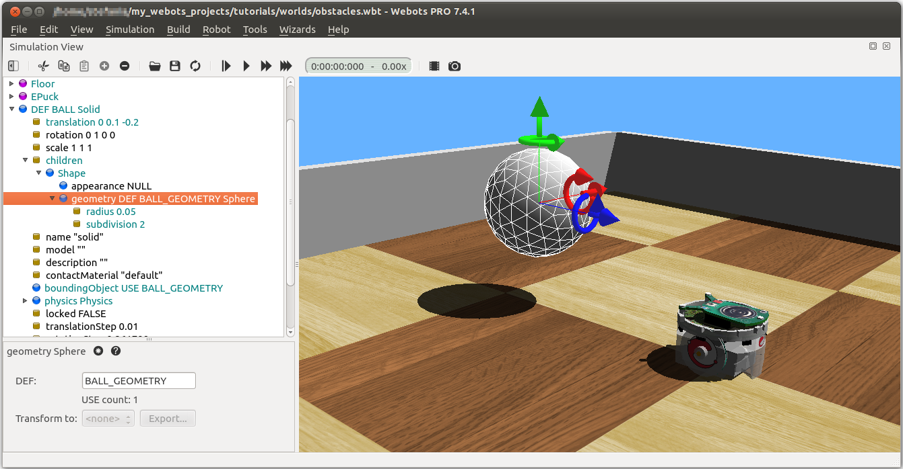
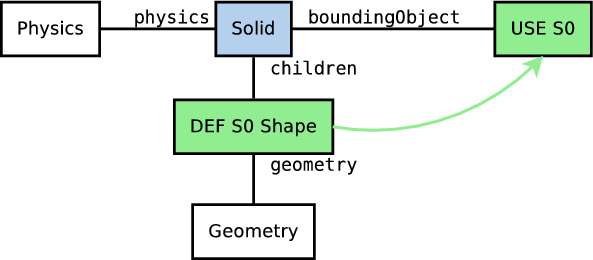
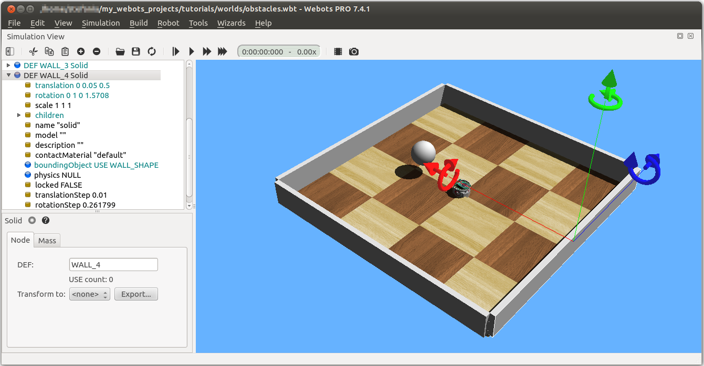

## Tutorial 2: Modification of the Environment (20 minutes)

In this tutorial, we will teach you how to create simple objects in the
environment. The first step will be to create a ball which will interact with
the environment. We will tackle several concepts related to the nodes: what is
their meaning, how to create them, how they have to be affiliated, etc. Moreover
we will see how to set up physics.

Several kinds of nodes will be introduced. We won't define each of them
precisely. Their detailed definition can be found in chapter 3 of the `Reference
Manual`. Having the nodes chart diagram (chapter 2 of the `Reference Manual`) in
front of you, will also help understanding the nodes inheritance relationship.

### A new Simulation

First we create a new simulation based on the one created in Tutorial 1.

> **handson**: Make sure the "my\_first\_simulation.wbt" world file is open, and that the
simulation is paused and is at a virtual time of 0. Using the `File > Save World
As...` menu, save the simulation as "obstacles.wbt".

### Modification of the Floor

The default `RectangleArena` PROTO defines a simple floor pinned on the statical
environment, i.e. without Physics node, and surrounded by walls.

> **note**: In order to define an object as static, its physics node has not to be set
(NULL).

Other pre-built floors are available in the Webots objects library. We will now
delete the default arena and add a simple floor that we will manually surround
the walls later in this this tutorial.

> **handson**: To remove the `RectangleArena`, select it in the scene tree view and press the
`Delete` button located in the toolbar.

> **handson**: In order to add a different floor PROTO, select the `DirectionalLight` node and
click on the `Add` button. In the open dialog box, and choose `PROTO (Webots) >
objects > floors > Floor (Solid)`.

The newly added `Floor` PROTO has a default size of 10mx10m, but it is possible
to adjust its size, its position and texture by changing the corresponding
fields.

> **handson**: In the scene tree view select and expand the `Floor`. Modify the `size` fields
and set it to *{1, 1}* to resize it to 1mx1m.

### The Solid Node

This subsection introduces the most important node in Webots: the `Solid` node.
But let's start with a definition.

> **theory**: A **rigid body** is a body in which deformation can be neglected. The distance
between any two given points of a rigid body remains constant in time regardless
of external forces exerted on it. Soft bodies and articulated objects are not
rigid bodies, e.g. these are not rigid bodies: a rope, a tyre, a sponge and an
articulated robot arm. However an articulated entity can be broken into of
several undividable rigid bodies. For example a table, a robot finger phalanx or
a wheel are undividable rigid bodies.

The physics engine of Webots is designed for simulating rigid bodies. An
important steps, when designing a simulation, is to break up the various
entities into undividable rigid bodies.

> **theory**: In Webots there is a direct matching between a rigid body and a **Solid** node.
A Solid node (or a node which inherits the Solid node) will be created for each
rigid body.

To define a rigid body, you will have to create a Solid node. Inside this node
you will find different subnodes corresponding to the characteristics of the
rigid body. The  depicts a rigid body and its subnodes. The graphical
representation of the Solid is defined by the Shape nodes populating its
`children` list. The collision bounds are defined by its `boundingObject` field.
The graphical representation and the collision shape are often but not
necessarily identical. Finally the `physics` field defines if the object belongs
to the dynamical or to the statical environment. All these subnodes are
optional, but the `physics` field needs the `boundingObject` to be defined.

%figure "The simplest model of a rigid body in Webots having a graphical representation (Shape), a physical bound (boundingObject) and being in the dynamical environment (Physics)."

%end

The Geometry box (in ) stands for any kind of geometrical primitive. In fact it
can be substituted by a Sphere, a Box, a Cylinder, etc.

### Create a Ball

We will now add a ball to the simulation. That ball will be modeled as a rigid
body as shown in the . As Geometry nodes we will use Spheres.

> **handson**: In the scene tree view, select the last node and add a Solid node using the
`Add` button. Similarly select the `children` field of the Solid node, and add a
Shape node to it. Add a Sphere node as the `geometry` field of the just created
Shape node. Add another Sphere node to the `boundingObject` field of the Solid.
Finally add a Physics node to the `physics` field of the Solid. By modifying the
`translation` field of the Solid node, place the ball in front of the robot (at
*{0, 0.1, -0.2}* for example). Save the simulation. The result is depicted in .

%figure "Your first rigid body in Webots."

%end

> **note**: When the simulation is started, the ball hits the floor. You can move the ball
by adding a force to it (CTRL + ALT + left-click + drag). The contact points
between the ball and the floor can be displayed as cyan lines by enabling the
`View > Optional Rendering > Show Contact Points` menu item.

### Geometries

To define the ball, we used the Sphere node in two different contexts: for the
graphical representation (`children`) and to define the physical bounds
(`boundingObject`). All Geometry node (such as the Sphere node) can be used in a
graphical context. However, only a subset of them can be used in a physical
context. Take a look at the schema of the chapter 2 of the `Reference Manual` to
now which primitive you can use.

We want now to reduce the size of the Sphere and to increase its graphical
quality by increasing the number of triangles used to represent it.

> **handson**: For each Sphere node defining the ball, set its `radius` field to *0.05* and its
`subdivision` field to *2*. Refer to the `Reference Manual` to understand what
the `subdivision` field stands for.

### DEF-USE mechanism

We will see in this subsection a mechanism which can be useful to avoid
redundancy in the world files.

> **theory**: The **DEF-USE mechanism** allows to define a node in one place and to reuse that
definition elsewhere in the Scene Tree. This avoids the duplication of identical
nodes and this allows to modify several nodes at the same time. Here is how this
works: first a node is labeled with a DEF string, and then copies of this node
are reused elsewhere with the USE keyword. Only the fields of the DEF node can
be edited, the fields of the USE nodes assume similar values. This mechanism is
dependent on the apparition order of the nodes in the world file, because the
DEF node should appear first.

The two Sphere definitions that we have used earlier to define the ball, are
redundant. We will now merge these two Spheres into only once using the DEF-USE
mechanism.

> **handson**: Select the first Sphere node (the child of the Shape) in the scene tree view.
The field editor of the scene tree view allows you to enter the DEF string.
Enter *"BALL\_GEOMETRY"*. Select the boundingObject field (containing the second
Sphere node), and delete it by using the `Reset to default` button. Then click
on the `Add` button, and select the `USE > BALL_GEOMETRY` in the dialog box. The
result is shown in .

> **note**: Now, changing the `radius` field of the first Sphere node does also modify the
`boundingObject`.

%figure "DEF-USE mechanism on the Sphere node called "BALL_GEOMETRY"."

%end

%figure "DEF-USE mechanism applied on the Shape node of a Solid."

%end

### Add Walls

> **theory**: For convenience, the `boundingObject` field accepts also the Shape node (rather
than the Sphere node directly). It would be also possible to use the same DEF-
USE mechanism at the Shape level as shown in . For now the best advantage is to
use this Shape also directly for graphical purposes. Later this will turn out to
be very useful for some sensors.

In order to verify your progression, implement by yourself four walls to
surround the environment. The walls have to be defined statically to the
environment, and use as much as possible the DEF-USE mechanism at the Shape
level rather than at the Geometry level. Indeed it's more convenient to add an
intermediate Shape node in the `boundingObject` field of the Solid node. The
best Geometry primitive to implement the walls is the Box node. Only one Shape
has to be defined for all the walls. The expected result is shown in .

> **handson**: Add four walls without physics and using only one definition of the Shape node.

The solution is located in the solution directory under the "obstacle.wbt".

%figure "The simulation state at the end of this second tutorial."

%end

### Efficiency

> **theory**: The simulation of rigid bodies is computationally expensive. The simulation
speed can be increased by minimizing the number of bounding objects, minimizing
the constraints between them (more information about the constraints in the next
tutorials), and maximizing the `WorldInfo.basicTimeStep` field. On each
simulation, a **trade-off** has to be found between the simulation speed and the
realism.

### Conclusion

At the end of this tutorial, you are able to create simple environments based on
rigid bodies. You are able to add nodes from the scene tree view and to modify
their fields. You have a more precise idea of what are the Solid, the Physics,
the Shape, the Sphere and the Box nodes. You saw also the DEF-USE mechanism that
allows to reduce node redundancy of the scene tree.

