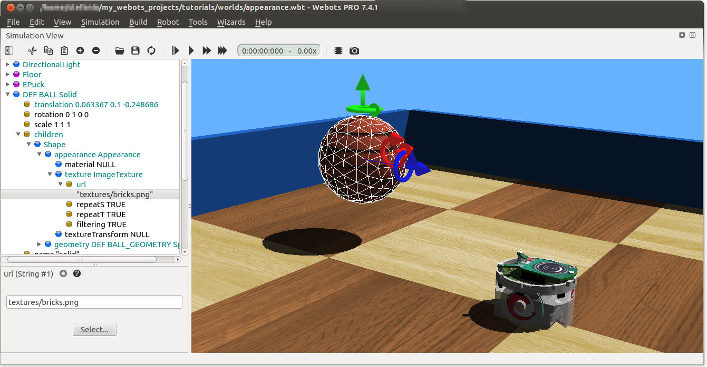

## Tutorial 3: Appearance (15 minutes)

The aim of this tutorial is to familiarize yourself with some nodes related to
the graphical rendering. Good looking simulations can be created very quickly
when these nodes are used adequately. A good graphics quality does not only
enhance the user's experience, it is also essential for simulations where robots
perceive their environment (camera image processing, line following, etc.).

The result at the end of this tutorial is shown in .

### New simulation

### Lights

Your simulation is currently lighted by a PointLight node at the top of the
scene. We want to replace this light node by a DirectionalLight node casting
shadows.

### Modify the Appearance of the Walls

The aim of this subsection is to color the walls with blue.

### Add a Texture to the Ball

The aim of this subsection is to apply a texture on the ball. A texture on a
rolling object can help to appreciate its movement.

####Simulation after having setup the Light and the Appearance nodes.

### Rendering Options

Webots offers several rendering modes available in the `View` menu.

### Conclusion

In this tutorial, you have learnt how to set up a good looking environment using
the Appearance node and the light nodes.

You can go further on this topic by reading the detailed description of these
nodes in the `Reference Manual`. The  will give you a method to efficiently
setup these nodes.

