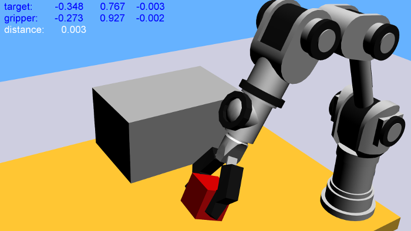

## Using the IPR robot

%figure "IPR"

%end

The IPR robot is a 6-DOF robotic arm mounted by a gripper composed of 2 rotational fingers.
It is developed by [Neuronics](http://www.neuronics.be/).
Four models are supported in Webots: HD6M180, HD6Ms180, HD6M90 and HD6Ms90.

More information is available on the Neuronics official [webpage](http://www.neuronics.be/).

### IPR models

The different IPR models shares the same device names.

%figure "IPR devices"

| Device | Support | Webots name |
| --- | --- | --- |
| Motors | Full support | base, upperarm, forearm, wrist, rotational\_wrist, left\_gripper and right\_gripper |
| Position sensors | Full support | base\_sensor, upperarm\_sensor, forearm\_sensor, wrist\_sensor, rotational\_wrist\_sensor, left\_gripper\_sensor and right\_gripper\_sensor |
| Touch sensors | Full support | ds[0-8] |
| Distance sensors | Full support | ts[0-3] |

%end

%figure "IPR device positions"

%end

The difference between the `90` and `180` models is the orientation of the gripper.
The number matches with the orientation angle in degrees of the gripper.

The difference between the "regular" models and the `s` ones (`s` for "strong") are small.
It's mainly about dimensions and maximum torques.

The table is added as a `tableSlot` of the robot, and is "fixed" in the dynamic environment.

### Samples

Here are listed the different example worlds based on the IPR.
The worlds and controllers can be accessed in the "WEBOTS\_HOME/projects/robots/neuronics/ipr" directory.

#### ipr\_collaboration.wbt

 In this example, two IPR robots work together to put three red cubes into a basket which is on the opposite side of the world.
All the IPR robots use the same controller, whose source code is in the "ipr/controllers" directory.
This particular example uses, in addition to this controller, a client program which coordinates the movements of the robots.
The source code for this client is in the "ipr/controllers/ipr\_collaboration.c" file.

#### ipr\_cube.wbt

 In this example, an IPR robots moves a small red cube onto a bigger one.
This example also uses a client program which drives the movements of the robot.
The source code for this client is in the "ipr/controllers/ipr\_cube.c" file.

#### ipr\_factory.wbt

 In this example, two IPR robots take industrial parts from a conveyor belt and place them into slots.
One of the robots detects the objects using an infrared sensor on the conveyor belt, while the other one waits.
This example also uses a client program which coordinates the movements of the robots.
The source code for this client is in the "ipr/controllers/ipr\_factory.c" file.

#### ipr\_models.wbt

 This example shows the different types of IPR model provided by Webots : HD6M180, HD6Ms180, HD6M90 and HD6Ms90.
The robots are not moving.
Open the generic robot window to actuate the motors.
