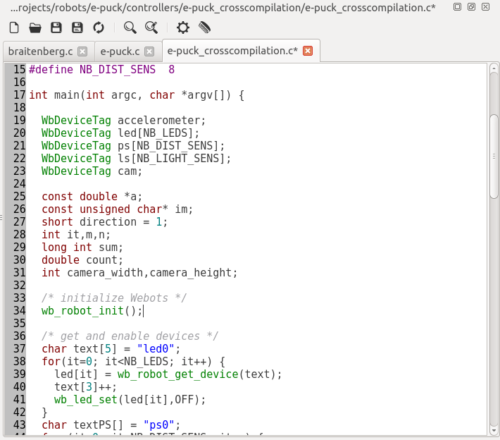

## Webots Built-in Editor

Webots source code editor is a multi-tab text editor specially adapted for
developing Webots controllers. It is usually recommended to use this editor as
it makes the compilation straightforward. The editor features syntax
highlighting for Webots supported language (C/C++, Java, Python and
*MATLAB*TM) and auto-completion for Webots C API.

%figure "Webots Text Editor"

%end

### Compiling with the Source Code Editor

The Source Code Editor can be used to compile C/C++ or Java source files into
binary executable or bytecode (Java) files that can be executed in a simulation.
The compilation output is printed to the Webots console; errors and warnings appear
in red. If you double-click an error message, Webots will highlight the
corresponding source line in the editor.

Note that, for compiling source code it is necessary to have the appropriate
development tools installed. You will find information on the development tools
[here](language-setup.md).

The possible compilation actions are listed below. Some of them are
only accessible in the `Build` menu, whereas `Build` and `Clean` actions have a
shortcut in the Text Editor toolbar.

 Builds the whole project by invoking `make`
in the selected file's directory. With C/C++, the `Build` button compiles and
links the whole project into an executable file. C/C++ source file dependencies
are automatically generated and updated when necessary. With Java, the `Build`
button compiles the whole project into bytecode (.class files).

 The `Clean` button invokes `make clean` to
delete the intermediate compilation files in the current file's directory. The
source files remain untouched.

The `Make JAR file` menu item rebuilds the whole project and packs all the
.class in a ".jar". This is a convenience function that can be used to pack a
complete controller prior to uploading it to one of our online contest website.

The `Cross-compile` menu item allows to cross-compile the current text editor's
file. Note that a specific Makefile is required in the controller's directory
for performing this operation. For an e-puck robot, this Makefile must be named
"Makefile.e-puck".

The `Cross-compilation clean` menu item allows you to clean the
cross-compilation files. Note that a specific Makefile is required in the
controller's directory for performing this operation. For an e-puck robot, this
Makefile must be named "Makefile.e-puck".
