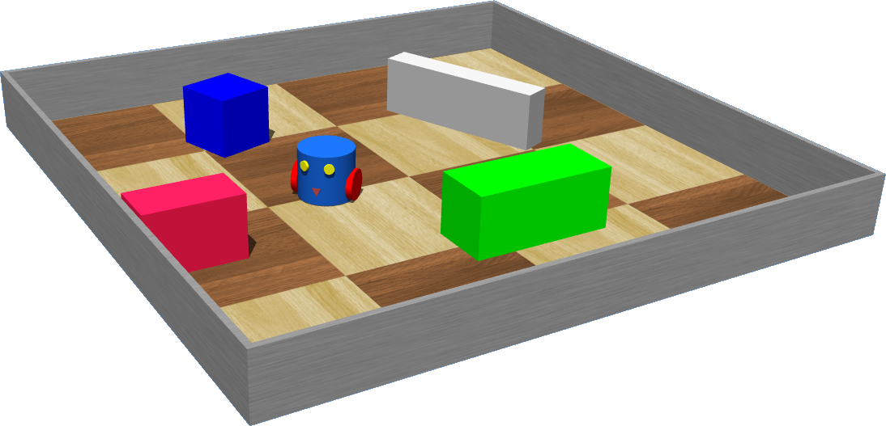
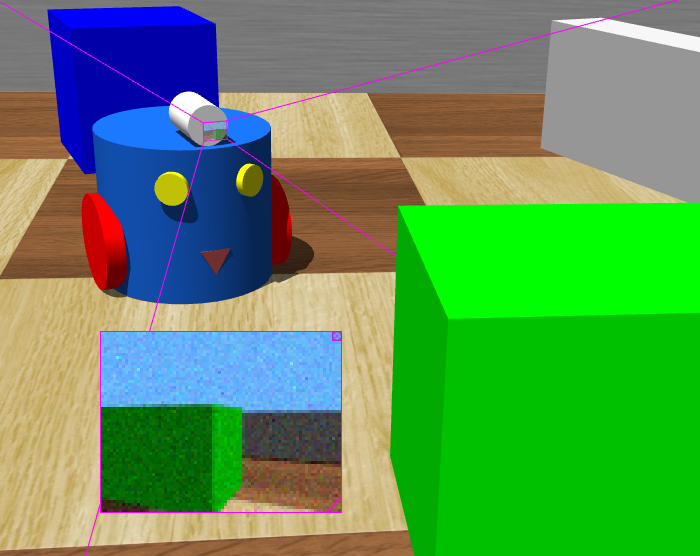
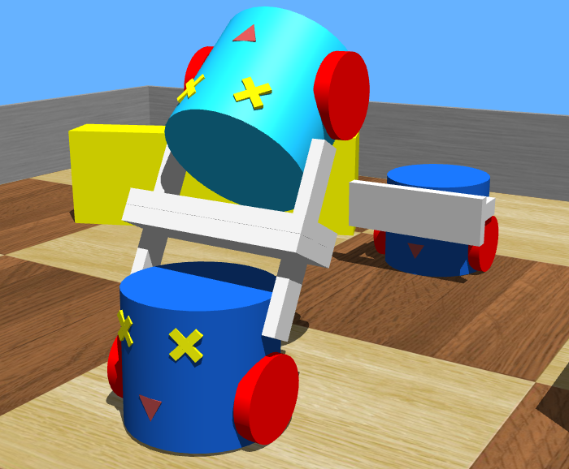
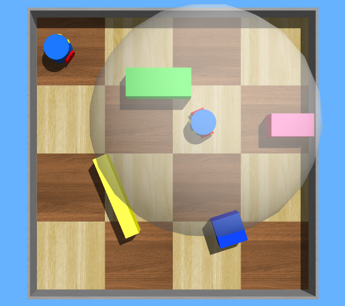
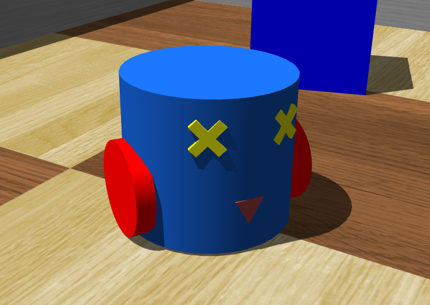

## Webots Devices

The "WEBOTS\_HOME/projects/samples/devices" directory contains Webots applications demonstrating the individual Webots devices and their corresponding API.

The world files are located in the "WEBOTS\_HOME/projects/samples/devices/worlds" directory, and their controllers in the "WEBOTS\_HOME/projects/samples/devices/controllers" directory.
The world files and the corresponding controllers are named according to the device they demonstrate.

Most of the devices below are shown using a simple two-wheeled blue robot called MyBot on a closed square arena containing obstacles (see [figure below](#mybot-in-closed-squared-arena)).
The studied devices are attached on this robot.

%figure "MyBot in closed squared arena."

%end

### battery.wbt

**Keywords**: Battery, Charger

 In this example, `MyBot` moves in a closed arena filled with obstacles.
The energy consumed by the wheel motors slowly discharges the robot's battery.
When the battery level reaches zero, the robot is powered off.
In order to remain powered, the robot must recharge its battery at energy chargers.
Chargers are represented by the semi-transparent colored cylinders in the four corners of the arena.
Only a full charger can recharge the robot's battery.
The color of a charger changes with its energy level: it is red when completely empty and green when completely full.

### bumper.wbt

**Keywords**: TouchSensor, bumper

 In this example, `MyBot` moves in a closed arena filled with obstacles.
Its "bumper" `TouchSensor` (represented by a black box) is used to detect collisions.
Each time a collision is detected, `MyBot` moves back and turns a bit.

### camera.wbt

**Keywords**: Camera, image processing, RGB pixel, Camera noise, PNG, ANSI

 In this example, `MyBot` uses a camera to detect colored objects.
The robot analyzes the RGB color level of each pixel of the camera images.
When it has detected something, it turns, stops for a few seconds and saves the current image in a PNG file to the user directory.
It also prints a colored message (using ANSI codes) in the Console explaining the type of object it has detected.

### connector.wbt

**Keywords**: Connector, RotationalMotor, IndexedLineSet

 In this example, a light `MyBot` (light blue) is lifted over two heavier `MyBot`s (dark blue).
All three robots are equipped with a `Connector` placed at the tip of a moveable handle (`HingeJoint`).
An `IndexedLineSet` is added to every `Connector` in order to show the axes.
When the simulation starts, the light robot approaches the first heavy robot and their connectors dock to one another.
Then both robots rotate their handles simultaneously, hence the light robot gets lifted over the heavy one.
Then the light robot gets passed over another time by the second heavy robot and so on ...
All the robots in this simulation use the same controller; the different behaviors are selected according to the robot's name.

### distance_sensor.wbt

**Keywords**: DistanceSensor, Braitenberg

 In this example, `MyBot` has eight `DistanceSensor`s placed at regular intervals around its body.
The robot avoids obstacles using the Braitenberg technique.

### emitter_receiver.wbt

**Keywords**: Emitter, Receiver, infra-red transmission

 In this example, there are two robots: one is equipped with an `Emitter`, the other one with a `Receiver`.
Both robots move among the obstacles while the *emitter* robot sends messages to the *receiver* robot.
The range of the `Emitter` device is indicated by the radius of the transparent sphere around the emitter robot.
The state of the communication between the two robots is displayed in the Console.
You can observe this when the *receiver* robot enters the *emitter*'s sphere while no direct obstacle is present on the route, then the communication is established, otherwise the communication is interrupted.
Note that the communication between "infra-red" `Emitter`s and `Receiver`s can be blocked by an obstacle, this is not the case with "radio" `Emitter`s and `Receiver`s.

### encoders.wbt

**Keywords**: encoders

 This example demonstrates the usage of the wheel encoders of `differential wheels` robots.
The controller randomly chooses target encoder positions, then it rotates its wheels until the encoder values reach the chosen target position.
Then the encoders are reset and the controller chooses new random values.
The robot does not pay any attention to obstacles.

### force_sensor.wbt

**Keywords**: Force, TouchSensor

 This example is nearly the same as "bumper.wbt" (see [this section](#bumper-wbt)).
The only difference is that this robot uses a "force"
`TouchSensor` instead of a "bumper".
So this robot can measure the force of each collision, which is printed in the Console window.

### gps.wbt

**Keywords**: GPS, Supervisor, keyboard

 This example shows two different techniques to find the current position of `MyBot`.
The first technique consists in using an on-board `GPS` device.
The second method uses a `Supervisor` controller that reads and transmits the position info to the robot.
Note that a `Supervisor` can read (or change) the position of any object in the simulation at any time.
This example implements both techniques, and you can choose either one or the other with the keyboard.
The 'G' key prints the robot's GPS device position.
The 'S' key prints the position read by the Supervisor.

### led.wbt

**Keywords**: LED

 In this example, `MyBot` moves while randomly changing the color of three `LED`s on the top of its body.
The color choice is printed in the Console.

### light_sensor.wbt

 In this example, `MyBot` uses two `LightSensor`s to follow a light source.
The light source can be moved with the mouse; the robot will follow it.

### pen.wbt

**Keywords**: Pen, keyboard

 In this example, `MyBot` uses a `Pen` device to draw on the floor.
The controller randomly chooses the ink color.
The ink on the floor fades slowly.
Use the 'Y' and 'X' keys to switch the `Pen` on and off.

### range_finder.wbt

**Keywords**: Range-finder, Camera

 In this example, `MyBot` uses a "range-finder" `Camera` to avoid obstacles.
The "range-finder" measures the distance to objects, so the robot knows if there is enough room to move forward or not.
