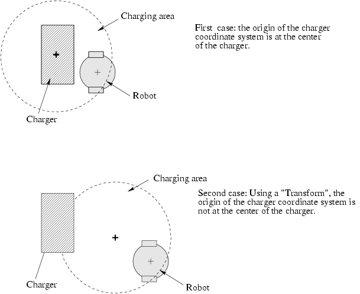

## Charger

Derived from `Solid`.


```
Charger {
  MFFloat   battery        []
  SFFloat   radius         0.04    # (0,inf)
  SFColor   emissiveColor  0 1 0   # [0,1]
  SFBool    gradual        TRUE
}
```

### Description

The `Charger` node is used to model a special kind of battery charger for the
robots. A robot has to get close to a charger in order to recharge itself. A
charger is not like a standard battery charger connected to a constant power
supply. Instead, it is a battery itself: it accumulates energy with time. It
could be compared to a solar power panel charging a battery. When the robot
comes to get energy, it can't get more than the charger has presently
accumulated.

The appearance of the `Charger` node can be altered by its current energy. When
the `Charger` node is full, the resulted color corresponds to its
`emissiveColor` field, while when the `Charger` node is empty, its resulted
color corresponds to its original one. Intermediate colors depend on the
`gradual` field. Only the first child of the `Charger` node is affected by this
alteration. The resulted color is applied only on the first child of the
`Charger` node. If the first child is a `Shape` node, the `emissiveColor` field
of its `Material` node is altered. If the first child is a `Light` node, its
`color` field is altered. Otherwise, if the first child is a `Group` node, a
recursive search is applied on this node and every `Light`, `Shape` and `Group`
nodes are altered according to the two previous rules.

### Field Summary

The fields specific to the `Charger` node are:

- `battery`: this field should contain three values, namely the present energy of the charger (*J*), its maximum energy (*J*) and its charging speed (*W=J/s*).
- `radius`: radius of the charging area in meters. The charging area is a disk centered on the origin of the charger coordinate system. The robot can recharge itself if its origin is in the charging area (see ).

<center>


####The sensitive area of a charger
</center>


- `emissiveColor`: color of the first child node (see above) when the charger is full.
- `gradual`: defines the behavior of the indicator. If set to TRUE, the indicator displays a progressive transition between its original color and the `emissiveColor` specified in the `Charger` node, corresponding to the present level of charge. If set to FALSE, the indicator remains its original color until the charger is fully charged (i.e., the present energy level equals the maximum energy level). Then, it switches to the specified `emissiveColor`.

