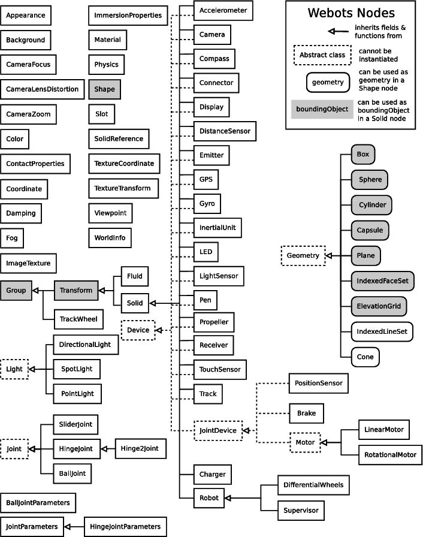

## Chart

The Webots Node Chart outlines all the nodes available to build Webots worlds.

In the chart, an arrow between two nodes represents an inheritance relationship.
The inheritance relationship indicates that a derived node (at the arrow tail)
inherits all the fields and API functions of a base node (at the arrow head).
For example, the `Supervisor` node inherits from the `Robot` node, and therefore
all the fields and functions available in the `Robot` node are also available in
the `Supervisor` node.

Boxes depicted with a dashed line (`Light`, `Device` and `Geometry`) represent
*abstract* nodes, that is, nodes that cannot be instantiated (either using the
SceneTree or in a ".wbt"  file). Abstract nodes are used to group common fields
and functions that are shared by derived nodes.

A box with round corners represents a `Geometry` node; that is, a node that will
be graphically depicted when placed in the `geometry` field of a `Shape` node.

A box with a grey background indicates a node that can be used directly (or
composed using `Group` and `Transform` nodes) to build a *boundingObject* used
to detect collisions between `Solid` objects. Note that not all geometry nodes
can be used as boundingObjects, and that although `Group` and `Transform` can be
used, not every combination of these will work correctly.

%figure "Webots Nodes Chart"

%end

