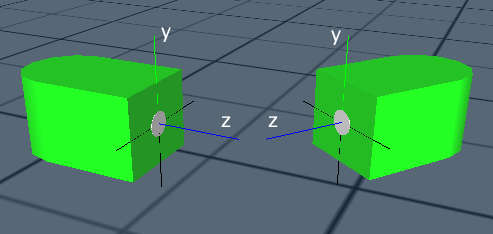

## Connector

Derived from `Device`.


```
Connector {
  SFString   type                "symmetric"
  SFBool     isLocked            FALSE
  SFBool     autoLock            FALSE
  SFBool     unilateralLock      TRUE
  SFBool     unilateralUnlock    TRUE
  SFFloat    distanceTolerance   0.01  # [0,inf)
  SFFloat    axisTolerance       0.2   # [0,pi)
  SFFloat    rotationTolerance   0.2   # [0,pi)
  SFInt32    numberOfRotations   4
  SFBool     snap                TRUE
  SFFloat    tensileStrength     -1
  SFFloat    shearStrength       -1
}
```

### Description

`Connector` nodes are used to simulate mechanical docking systems, or any other
type of device, that can dynamically create a physical link (or *connection*)
with another device of the same type.

`Connector` nodes can only connect to other `Connector` nodes. At any time, each
connection involves exactly two `Connector` nodes (peer to peer). The physical
connection between two `Connector` nodes can be created and destroyed at run
time by the robot's controller. The primary idea of `Connector` nodes is to
enable the dynamic reconfiguration of modular robots, but more generally,
`Connector` nodes can be used in any situation where robots need to be attached
to other robots.

`Connector` nodes were designed to simulate various types of docking hardware:

Connectors can be classified into two types, independent of the actual hardware
system:

*Symmetric connectors*, where the two connecting faces are mechanically (and
electrically) equivalent. In such cases both connectors are active.

*Asymmetric connectors*, where the two connecting interfaces are mechanically
different. In asymmetric systems there is usually one active and one passive
connector.

The detection of the presence of a peer `Connector` is based on simple distance
and angle measurements, and therefore the `Connector` nodes are a
computationally inexpensive way of simulating docking mechanisms.

### Field Summary

### Connector Axis System

A `Connector`'s axis system is displayed by Webots when the corresponding robot
is selected or when *Display Axes* is checked in Webots *Preferences*. The
*z*-axis is drawn as a 5 cm blue line, the y-axis (a potential docking rotation)
is drawn as a 5 cm red line, and each additional potential docking rotation is
displayed as a 4 cm black line. The bounding objects and graphical objects of a
`Connector` should normally be designed such that the docking surface
corresponds exactly to *xy*-plane of the local coordinate system. Furthermore,
the `Connector`'s z-axis should be perpendicular to the docking surface and
point outward from the robot body. Finally, the bounding objects should allow
the superposition of the origin of the coordinate systems. If these design
criteria are not met, the `Connector` nodes will not work properly and may be
unable to connect.


**Connector axis system**

### Connector Functions

