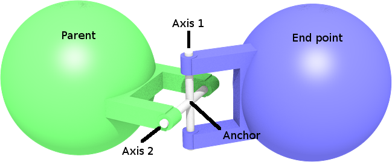

## Hinge2Joint

Derived from [HingeJoint](hingejoint.md).

```
Hinge2Joint {
  SFNode   jointParameters2 NULL     # JointParameters for second axis
  MFNode   device2          []       # RotationalMotor, PositionSensor and Brake
  SFFloat .position2        0        # initial position with respect to the second hinge (rad)
}
```

### Description

%figure "Hinge 2 joint"



%end

The [Hinge2Joint](#hinge2joint) node can be used to model a hinge2 joint, i.e. a
joint allowing only rotational motions around two intersecting axes (2 degrees
of freedom). These axes cross at the `anchor` point and need not to be
perpendicular. The suspension fields defined in a
[HingeJointParameters](hingejointparameters.md) node allow for spring and
damping effects along the suspension axis.

Note that a universal joint boils down to a hinge2 joint with orthogonal axes
and (default) zero suspension.

Typically, [Hinge2Joint](#hinge2joint) can be used to model a steering wheel
with suspension for a car, a shoulder or a hip for a humanoid robot.

> **Note**:
A [Hinge2Joint](#hinge2joint) will connect only [Solid](solid.md)s having a
[Physics](physics.md) node. In other words, this joint cannot be statically
based.

### Field Summary

- `jointParameters2`: This field optionally specifies a
[HingeJointParameters](hingejointparameters.md) node It contains, among others,
the joint position, the axis position expressed in relative coordinates, the
stop positions and suspension parameters. If the `jointParameters` field is left
empty, default values of the HingeJointParameters node apply.

- `device2`: This field optionally specifies a
[RotationalMotor](rotationalmotor.md), an angular
[PositionSensor](positionsensor.md) and/or a [Brake](brake.md) device attached
to the second axis. If no motor is specified, this part of the joint is passive.

- `.position2`: see [joint's hidden position field](rotationalmotor.md).
