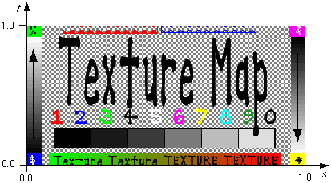

## ImageTexture


```
ImageTexture {
  MFString   url       []
  SFBool     repeatS   TRUE
  SFBool     repeatT   TRUE
  SFBool     filtering TRUE
}
```

### Description

The `ImageTexture` node defines a texture map by specifying an image file and
general parameters for mapping to geometry. Texture maps are defined in a 2D
coordinate system *(s,t)* that ranges from 0.0 to 1.0 in both directions. The
bottom edge of the image corresponds to the *s*-axis of the texture map, and
left edge of the image corresponds to the *t*-axis of the texture map. The
lower-left pixel of the image corresponds to *s=0, t=0*, and the top-right pixel
of the image corresponds to *s=1, t=1*. These relationships are depicted below.


**Texture map coordinate system**

The texture is read from the file specified by the `url` field. The file should
be specified with a relative path (cf. ). Absolute paths work as well, but they
are not recommended because they are not portable across different systems.
Ideally, the texture file should lie next to the world file, possibly inside a
"textures" subfolder. Supported image formats include both JPEG and PNG. The
rendering of the PNG alpha transparency is supported. It is slightly more
efficient to use textures with power of 2 resolution (e.g. 8x8, 2048x64, etc.).
Otherwise an internal upscaling is performed.

A PNG image may contain an alpha channel. If such an alpha channel exists, the
texture becomes semi-transparent. This is useful to render for example a scissor
cut texture. Semi-transparent objects are sorted according to their center (the
local position of the parent Transform) and are rendered in the same rendering
queue as the objects having a transparent material (see the `transparency` field
of the `Material` node). Semi-transparent objects cannot receive and cannot cast
shadows.

If the image contains an alpha channel no texture filtering is performed,
otherwise both a trilinear interpolation and an anisotropic texture filtering is
applied (the texture is subsampled according to the distance and the angle
between the textured polygon and the camera).

The `repeatS` and `repeatT` fields specify how the texture wraps in the *s* and
*t* directions. If `repeatS` is `TRUE` (the default), the texture map is
repeated outside the [0.0,1.0] texture coordinate range in the *s* direction so
that it fills the shape. If `repeatS` is `FALSE`, the texture coordinates are
clamped in the *s* direction to lie within the [0.0,1.0] range. The `repeatT`
field is analogous to the `repeatS` field.

The `filtering` field defines whether the texture will be displayed using a
texture filtering or not. No filtering corresponds to a simple nearest-neighbor
pixel interpolation filtering method. Filtering corresponds to both an
anisotropic filtering method (using mipmapping) which chooses the smallest
mipmap according to the texture orientation and to the texture distance, and a
trilinear filtering method which smooths the texture. Using filtering doesn't
affect significantly the run-time performance, however it may increase slightly
the initialization time because of the generation of the mipmaps.

### Search rule of the texture path

The texture path is searched from the corresponding `url` element according to
the following rule:


```

i = current_url_index
generic_textures_path = "$WEBOTS_MODULES_PATH/projects/default/worlds"
if is_absolute(url[i]) then
  if is_existing(url[i])
    return url[i]
  else
    return Error
else
  if defined_in_a_PROTO(current_node) and is_existing(PROTO_path + url[i])
    return PROTO_path + url[i]
  else if is_existing(world_path + url[i])
    return world_path + url[i]
  else if is_existing(generic_textures_path + url[i])
    return generic_textures_path + url[i]
  endif
endif
return Error
  
```

