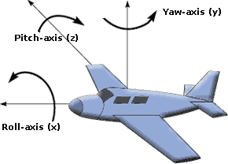

## InertialUnit

Derived from [Device](device.md).

```
InertialUnit {
  MFVec3f    lookupTable    []    # interpolation
  SFBool     xAxis          TRUE  # compute roll
  SFBool     zAxis          TRUE  # compute pitch
  SFBool     yAxis          TRUE  # compute yaw
  SFFloat    resolution     -1
}
```

### Description

The [InertialUnit](#inertialunit) node simulates an *Inertial Measurement Unit*
(IMU). The [InertialUnit](#inertialunit) computes and returns its *roll*,
*pitch* and *yaw* angles with respect to a global coordinate system defined in
the [WorldInfo](worldinfo.md) node. If you would like to measure an acceleration
or an angular velocity, please use the [Accelerometer](accelerometer.md) or
[Gyro](gyro.md) node instead. The [InertialUnit](#inertialunit) node must be
placed on the [Robot](robot.md) so that its *x*-axis points in the direction of
the [Robot](robot.md)'s forward motion (longitudinal axis). The positive
*z*-axis must point towards the [Robot](robot.md)'s right side, e.g., right arm,
right wing (lateral axis). The positive *y*-axis must point to the
[Robot](robot.md)'s up/top direction. If the [InertialUnit](#inertialunit) has
this orientation, then the *roll*, *pitch* and *yaw* angles correspond to the
usual automotive, aeronautics or spatial meaning.  More precisely, the
[InertialUnit](#inertialunit) measures the Tait-Bryan angles along *x*-axis
(roll), *z*-axis (pitch) and *y*-axis (yaw). This convention is commonly
referred to as the *x-z-y* extrinsic sequence; it corresponds to the composition
of elemental rotations denoted by YZX. The reference frame is made of the unit
vector giving the north direction, the opposite of the normalized gravity vector
and their cross-product (see [WorldInfo](worldinfo.md) to customize this frame).

> **note**:
In a gimbal lock situation, i.e., when the pitch is -π/2 or π/2, the roll and
the yaw are set to NaN (Not a Number).

### Field Summary

- `lookupTable`: This field optionally specifies a lookup table that can be used
for changing the angle values [rad] into device specific output values, or for
changing the units to degrees for example. With the lookup table it is also
possible to define the min and max output values and to add noise to the output
values. By default the lookup table is empty and therefore the returned angle
values are expressed in radians and no noise is added.

- `xAxis, yAxis, zAxis`: Each of these boolean fields specifies if the computation
should be enabled or disabled for the specified axis. The `xAxis` field defines
whether the *roll* angle should be computed. The `yAxis` field defines whether
the *yaw* angle should be computed. The `zAxis` field defines whether the
*pitch* angle should be computed. If one of these fields is set to FALSE, then
the corresponding angle element will not be computed and it will return *NaN*
(Not a Number). For example if `zAxis` is FALSE, then
`wb_inertial_unit_get_values()[2]` returns *NaN*. The default is that all three
axes are enabled (TRUE).

%figure "Roll, pitch and yaw angles in Webots' Inertial Unit"



%end

- `resolution`: This field allows to define the resolution of the sensor, the
resolution is the smallest change that it is able to measure. Setting this field
to -1 (default) means that the sensor has an 'infinite' resolution (it can
measure any infinitesimal change). This field accepts any value in the interval
(0.0, inf).

### InertialUnit Functions

**Name**

**wb\_inertial\_unit\_enable**, **wb\_inertial\_unit\_disable**, **wb\_inertial\_unit\_get\_sampling\_period**, **wb\_inertial\_unit\_get\_roll\_pitch\_yaw** - *enable, disable and read the output values of the inertial unit*

{[C++](cpp-api.md#cpp_inertial_unit)}, {[Java](java-api.md#java_inertial_unit)}, {[Python](python-api.md#python_inertial_unit)}, {[Matlab](matlab-api.md#matlab_inertial_unit)}, {[ROS](ros-api.md)}

``` c
#include <webots/inertial_unit.h>

void wb_inertial_unit_enable(WbDeviceTag tag, int ms)
void wb_inertial_unit_disable(WbDeviceTag tag)
int wb_inertial_unit_get_sampling_period(WbDeviceTag tag)
const double *wb_inertial_unit_get_roll_pitch_yaw(WbDeviceTag tag)
```

**Description**

The `wb_inertial_unit_enable()` function turns on the angle measurement each
`ms` milliseconds.
The provided `ms` argument specifies the sensor's sampling period.
Note that the first measurement will be available only after the first sampling period elapsed.

The `wb_inertial_unit_disable()` function turns off the
[InertialUnit](#inertialunit) device.

The `wb_inertial_unit_get_sampling_period()` function returns the period given
into the `wb_inertial_unit_enable()` function, or 0 if the device is disabled.

The `wb_inertial_unit_get_roll_pitch_yaw()` function returns the current *roll*,
*pitch* and *yaw* angles of the [InertialUnit](#inertialunit). The values are
returned as an array of 3 components therefore only the indices 0, 1, and 2 are
valid for accessing the returned array. Note that the indices 0, 1 and 2 return
the *roll*, *pitch* and *yaw* angles respectively.

The *roll* angle indicates the unit's rotation angle about its *x*-axis, in the
interval [-π,π]. The *roll* angle is zero when the
[InertialUnit](#inertialunit) is horizontal, i.e., when its *y*-axis has the
opposite direction of the gravity ([WorldInfo](worldinfo.md) defines the
`gravity` vector).

The *pitch* angle indicates the unit's rotation angle about is *z*-axis, in the
interval [-π/2,π/2]. The *pitch* angle is zero when the
[InertialUnit](#inertialunit) is horizontal, i.e., when its *y*-axis has the
opposite direction of the gravity. If the [InertialUnit](#inertialunit) is
placed on the [Robot](robot.md) with a standard orientation, then the *pitch*
angle is negative when the [Robot](robot.md) is going down, and positive when
the robot is going up.

The *yaw* angle indicates the unit orientation, in the interval [-π,π], with
respect to [WorldInfo](worldinfo.md).`northDirection`. The *yaw* angle is zero
when the [InertialUnit](#inertialunit)'s *x*-axis is aligned with the north
direction, it is π/2 when the unit is heading east, and -π/2 when the unit is
oriented towards the west. The *yaw* angle can be used as a compass.

> **note** [C, C++]:
The returned vector is a pointer to internal values managed by the Webots,
therefore it is illegal to free this pointer. Furthermore, note that the pointed
values are only valid until the next call to `wb_robot_step()` or
`Robot::step()`. If these values are needed for a longer period they must be
copied.

<!-- -->

> **note** [Python]:
`getRollPitchYaw()` returns the angles as a list containing three floats.
