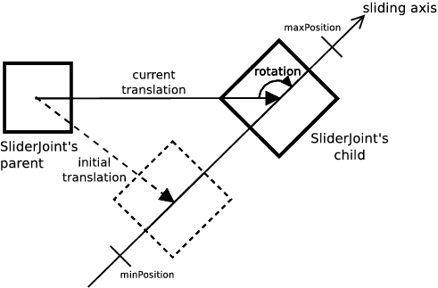
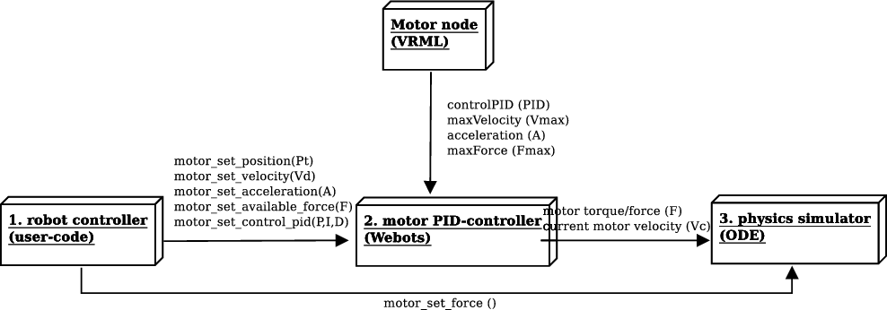

## Motor

Derived from `Device`.


```
Motor {
  SFFloat maxVelocity  10 # (m/s or rad/s): (0,inf)
  SFVec3f controlPID   10 0 0 # PID gains: (0,inf), [0, inf), [0, inf)
  SFFloat acceleration -1 # (m/s^2 or rad/s^2): -1 or (0,inf)
  SFFloat minPosition  0  # (m or rad): (-inf,inf) or [-pi, pi]
  SFFloat maxPosition  0  # (m or rad): (-inf,inf) or [-pi, pi]
}
```

### Description

A `Motor` node is an abstract node (not instantiated) whose derived classes can
be used in a mechanical simulation to power a joint hence producing a motion
along, or around, one of its axes.

A `RotationalMotor` can power a `HingeJoint` (resp. a `Hinge2Joint`) when set
inside the `device` (resp. `device` or `device2`) field of these nodes. It
produces then a rotational motion around the choosen axis. Likewise, a
`LinearMotor` can power a `SliderJoint`, producing a sliding motion along its
axis.

### Field Summary

- The `maxVelocity` field specifies both the upper limit and the default value for the motor *velocity*. The *velocity* can be changed at run-time with the `wb_motor_set_velocity()` function. The value should always be positive (the default is 10).
- The first coordinate of `controlPID` field specifies the initial value of the *P* parameter, which is the *proportional gain* of the motor PID-controller. A high *P* results in a large response to a small error, and therefore a more sensitive system. Note that by setting *P* too high, the system can become unstable. With a small *P*, more simulation steps are needed to reach the target position, but the system is more stable.The second coordinate of `controlPID` field specifies the initial value of the *I* parameter, which is the *integral gain* of the motor PID-controller. The integral term of the PID controller is defined as the product of the error integral over time by *I*. This term accelerates the movement towards target position and eliminates the residual steady-state error which occurs with a pure proportional controller. However, since the integral term represents accumulated errors from the past, it can cause the present value to overshoot the target position.The third coordinate `controlPID` field specifies the initial value of the *D* parameter, which is the *derivative gain* of the motor PID-controller. The derivative term of the PID-controller is defined as the product of the error derivative with respect to time by *D*. This term predicts system behavior and thus improves settling time and stability of the system.The value of *P, I* and *D* can be changed at run-time with the `wb_motor_set_control_pid()` function.
- The `acceleration` field defines the default acceleration of the P-controller. A value of -1 (infinite) means that the acceleration is not limited by the P-controller. The acceleration can be changed at run-time with the `wb_motor_set_acceleration()` function.
- The `position` field represents the current *position* of the `Motor`, in radians or meters. For a rotational motor, `position` represents the current rotation angle in radians. For a linear motor, `position` represents the magnitude of the current translation in meters.
- The `minPosition` and `maxPosition` fields specify *soft limits* for the target position. These fields are described in more detail in the "Motor Limits" section, see below.

### Units

By *motor position*, we mean joint position as defined in `JointParameters`.
Rotational motors units are expressed in *radians* while linear motors units are
expressed in *meters*. See :

|  | Rotational | Linear |
| --- | --- | --- |
| Position | rad (radians) | m (meters) |
| Velocity | rad/s (radians / second) | m/s (meters / second) |
| Acceleration | rad/s^2 (radians / second^2) | m/s^2 (meters / second^2) |

### Initial Transformation and Position

The `minPosition` and `maxPosition` are defined with respect to joint's zero
position (see description of the `position` field in `JointParameters`).

<center>


####Linear Motor
</center>

<center>


####Rotational Motor
</center>

### Position Control

The standard way of operating a `Motor` is to control the position directly
(*position control*). The user specifies a target position using the
`wb_motor_set_position()` function, then the P-controller takes into account the
desired velocity, acceleration and motor force in order to move the motor to the
target position. See .

In Webots, position control is carried out in three stages, as depicted in . The
first stage is performed by the user-specified controller (1) that decides which
position, velocity, acceleration and motor force must be used. The second stage
is performed by the motor P-controller (2) that computes the current velocity of
the motor `V`. Finally, the third stage (3) is carried out by the physics
simulator (ODE joint motors).

<center>


####Motor control
</center>


At each simulation step, the PID-controller (2) recomputes the current velocity *Vc* according to following algorithm:

```
error = Pt - Pc;
error_integral += error * ts;
error_derivative = (previous_error - error) / ts;
Vc = P * error + D * error_derivative + I * error_integral ;
if (abs(Vc) > Vd)
  Vc = sign(Vc) * Vd;
if (A != -1) {
  a = (Vc - Vp) / ts;
  if (abs(a) > A)
    a = sign(a) * A;
  Vc = Vp + a * ts;
}
```

where  `V` is the current motor velocity in rad/s or m/s,
`P, I` and `D` are the PID-control gains specified in the `controlPID` field,
or set with `wb_motor_set_control_pid()`,
`P` is the *target position* of the motor set by the function `wb_motor_set_position()`,
`P` is the current motor position as reflected by the `position` field,
`V` is the desired velocity as specified by the `maxVelocity`
field (default) or set with `wb_motor_set_velocity()`,
`a` is the acceleration required to reach *Vc* in one time step,
`V` is the motor velocity of the previous time step,
`t` is the duration of the simulation time step as specified by the
`basicTimeStep` field of the `WorldInfo` node (converted in seconds), and
`A` is the acceleration of the motor as specified by the `acceleration`
field (default) or set with `wb_motor_set_acceleration()`.


### Velocity Control


The motors can also be used with *velocity control* instead of *position control*.
This is obtained with two function calls: first the `wb_motor_set_position()` function
must be called with `INFINITY` as a position parameter,
then the desired velocity, which may be positive or negative, must be specified by calling the `wb_motor_set_velocity()` function.
This will initiate a continuous motor motion at the desired speed, while taking into account
the specified acceleration and motor force. Example:

```
wb_motor_set_position(motor, INFINITY);
wb_motor_set_velocity(motor, 6.28);  // 1 rotation per second
```

`INFINITY` is a C macro corresponding to the IEEE 754 floating point standard.
It is implemented in the C99 specifications as well as in C++.
In Java, this value is defined as `Double.POSITIVE_INFINITY`.
In Python, you should use `float('inf')`.
Finally, in Matlab you should use the `inf` constant.


### Force and Torque Control

The position (resp. velocity) control described above are performed by the
Webots PID-controller and ODE's joint motor implementation (see ODE
documentation). As an alternative, Webots does also allow the user to directly
specify the amount of force (resp. torque) that must be applied by a `Motor`.
This is achieved with the `wb_motor_set_force()` (resp. `wb_motor_set_torque()`)
function which specifies the desired amount of forces (resp. torques) and
switches off the PID-controller and motor force (resp. motor torque). A
subsequent call to `wb_motor_set_position()` restores the original *position
control*. Some care must be taken when using *force control*. Indeed the force
(resp. torque) specified with `wb_motor_set_force()` (resp.
`wb_motor_set_torque()`) is applied to the `Motor` continuously. Hence the
`Motor` will infinitely accelerate its rotational or linear motion and
eventually *explode* unless a functional force control (resp. torque control)
algorithm is used.

|  | position control | velocity control | force or torque control |
| --- | --- | --- | --- | --- |
| uses PID-controller | yes | no | no |
| wb_motor_set_position() | * specifies the desired position | should be set to INFINITY | switches to position/velocity control |
| wb_motor_set_velocity() | specifies the max velocity | * specifies the desired velocity | is ignored |
| wb_motor_set_acceleration() | specifies the max acceleration | specifies the max acceleration | is ignored |
| wb_motor_set_available_force() (resp. wb_motor_set_available_torque()) | specifies the available force (resp. torque) | specifies the available force (resp. torque) | specifies the max force (resp. max torque) |
| wb_motor_set_force() (resp. wb_motor_set_torque()) | switches to force control (resp. torque control) | switches to force control (resp. torque control) | * specifies the desired force (resp. torque) |

### Motor Limits

The `minPosition` and `maxPosition` fields define the *soft limits* of the
motor. Motor zero position and joint zero position coincide (see description of
the `position` field in `JointParameters`). Soft limits specify the *software*
boundaries beyond which the PID-controller will not attempt to move. If the
controller calls `wb_motor_set_position()` with a target position that exceeds
the soft limits, the desired target position will be clipped in order to fit
into the soft limit range. Valid limits values depends on the motor position,
i.e. `minPosition` must always be less than or equal to the motor position and
`maxPosition` must always be greater than or equal to the motor position. When
both `minPosition` and `maxPosition` are zero (the default), the soft limits are
deactivated. Note that the soft limits can be overstepped when an external force
which exceeds the motor force is applied to the motor. For example, it is
possible that the weight of a robot exceeds the motor force that is required to
hold it up.

Finally, note that when both soft (`minPosition` and `maxPosition`) and hard
limits (`minStop` and `maxStop`, see `JointParameters`) are activated, the range
of the soft limits must be included in the range of the hard limits, such that
`minStop lt= minValue` and `maxStopgt= maxValue`. Moreover a simulation
instability can appear if `position` is exactly equal to one of the bounds
defined by the `minStop` and `maxStop` fields at the simulation startup.
Warnings are displayed if theses rules are not respected.

### Motor Functions

