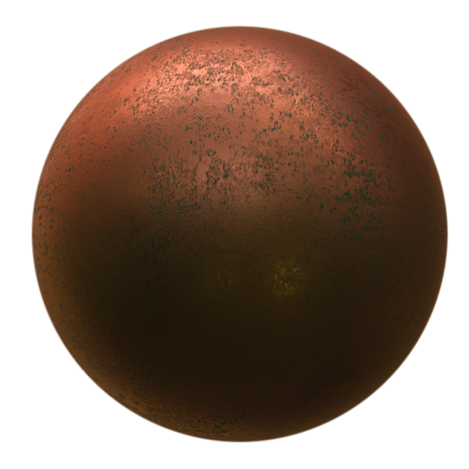

## PBRAppearance

```
PBRAppearance {
  SFColor  baseColor            1 1 1             # any color
  SFNode   baseColorMap         NULL              # {ImageTexture, PROTO}
  SFFloat  transparency         0                 # [0, 1]
  SFFloat  roughness            0                 # [0, 1]
  SFNode   roughnessMap         NULL              # {ImageTexture, PROTO}
  SFFloat  metalness            1                 # [0, 1]
  SFNode   metalnessMap         NULL              # {ImageTexture, PROTO}
  SFNode   environmentMap       NULL              # {Cubemap, PROTO}
  SFFloat  IBLStrength          1                 # [0, inf)
  SFNode   normalMap            NULL              # {ImageTexture, PROTO}
  SFFloat  normalMapFactor      1                 # [0, inf)
  SFNode   occlusionMap         NULL              # {ImageTexture, PROTO}
  SFFloat  occlusionMapStrength 1                 # [0, inf)
  SFNode   textureTransform     NULL              # {TextureTransform, PROTO}
  SFString name                 "PBRAppearance"   # any string
}
```

### Description

%figure "An Oxidised Copper Sphere made with the PBRAppearance node"



%end

The [PBRAppearance](#pbrappearance) node specifies a physically-based visual appearance of a node.
The acronym "PBR" refers to "Physically-Based Rendering", a term used to designate a class of shading models based on the physical properties of an object, as opposed to .

This modern technique enables highly realistic rendering for every kind of object, in any kind of lighting environment.

For a detailed guide on PBR and how to use it for content creation and model design, an excellent description of the concepts on this subject can be found [on this blog post by Marmoset](https://www.marmoset.co/posts/physically-based-rendering-and-you-can-too/).

Our PBR shading model makes use of Lambertian Diffuse, Cook-Torrence Specular and Fresnel-Schlick GGX for direct illumination, and an advanced Image-Based Lighting (IBL) BRDF for ambient diffuse lighting and reflections.

### Field Summary

- The `baseColor` field specifies the base color or "albedo" of the material's surface, analogous to the `diffuseColor` field of the [Material](material.md) node.
- The `baseColorMap` field specifies an [ImageTexture](imagetexture.md) for the material's albedo which overrides `baseColor`.
- The `transparency` field specifies the transparency of the object.
If `transparency` is non-zero, the object no longer casts shadows.
- The `roughness` field specifies the roughness of the material's surface, analogous to the inverse of the `shininess` field of the [Material](material.md) node.
A roughness of 0 gives a perfectly smooth material, while a roughness of 1 gives a highly rough material.
- The `roughnessMap` field specifies an [ImageTexture](imagetexture.md) for the material's roughness which overrides `roughness`.
- The `metalness` field specifies how metallic the material's surface is.
A metalness of 0 gives a completely dielectric material, while a metalness of 1 gives a completely metallic material.
Note: it is encouraged to use either 1 or 0 for this value as no real-world materials are partly metallic.
- The `metalnessMap` field specifies an [ImageTexture](imagetexture.md) for the material's metalness which overrides `metalness`.
- The `environmentMap` field allows an object shaded with PBR to specify its source for ambient lighting and reflections (IBL), using a [Cubemap](cubemap.md) node.
If this field is empty, the [Cubemap](cubemap.md) belonging to the world's [Background](background.md) node (if it exists) will be used as this source.
- The `IBLStrength` field specifies a scale factor to be applied to the light contribution from the [Cubemap](cubemap.md).
- The `normalMap` field specifies an [ImageTexture](imagetexture.md) which is used to peturb the normal vectors of each vertex to create the appearance of relief on flat surfaces, or to add extra detail to low-polycount meshes.
- The `normalMapFactor` field is used to scale the effect of the normal map on the object.
- The `occlusionMap` field specifies an [ImageTexture](imagetexture.md) which contains pre-baked information about how parts of the model occlude each other (ambient occlusion). This can be used for more realistic-looking lighting.
- The `occlusionMapStrength` field is used to scale the effect of the occlusion map on the object.
- The `textureTransform` field contains a [TextureTransform](texturetransform.md) node.
If `textureTransform` is NULL, the `textureTransform` field has no effect.
- The `name` field is used to give a unique identifier to a [PBRAppearance](#pbrappearance) node such that if it is included in an MFNode field it can be retrieved by this name.
This name is not required to be unique if the [Appearance](#Appearance) node is inserted into an SFNode field.
