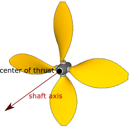

## Propeller


```
Propeller {
  field SFVec3f shaftAxis       1 0 0 # (m)
  field SFVec3f centerOfThrust  0 0 0 # (m)
  field SFVec2f thrustConstants 1 0   # Ns^2/rad : (-inf, inf), Ns^2/(m*rad) : (-inf, inf)
  field SFVec2f torqueConstants 1 0   # Nms^2/rad : (-inf, inf), Ns^2/rad : (-inf, inf)
  field SFNode device NULL            # RotationalMotor
  field SFNode fastHelix NULL         # Solid node containing a graphical representation for rotation speed gt 24 pi rad/s (720 rpm)
  field SFNode slowHelix NULL         # Solid node containing a graphical representation for rotation speed lt= 24 pi rad/s
}
```

### Description


%figure "Propeller"

%end

The `Propeller` node can be used to model a marine or an aircraft propeller.
When its `device` field is set with a `RotationalMotor`, the propeller turns the
motor angular velocity into a thrust and a (resistant) torque. The resultant
thrust is the product of a real number T by the unit length shaft axis vector
defined in the `shaftAxis` field, with T given by the formula

```
T = t1 * |omega| * omega - t2 * |omega| * V
```

and where t1 and t2 are the constants specified in the `thrustConstants` field,
omega is the motor angular velocity and V is the component of the linear
velocity of the center of thrust along the shaft axis. The thrust is applied at
the point specified within the `centerOfThrust` field.  The resultant torque is
the product of a real number Q by the unit length shaft axis vector, with Q
given by the formula

```
Q = q1 * |omega| * omega - q2 * |omega| * V
```

and where q1 and q2 are the constants specified in the `torqueConstants` field.

The above formulae are based on "Guidance and Control of Ocean Vehicles" from
Thor I. Fossen and "Helicopter Performance, Stability, and Control" from Raymond
W. Prouty.

The example "propeller.wbt" located in the "projects/samples/devices/worlds"
directory of Webots shows three different helicopters modeled with `Propeller`
nodes.

### Field Summary

- `shaftAxis`: defines the axis along which the resultant thrust and torque will
be exerted, see .
- `centerOfThrust`: defines the point where the generated thrust applies, see .
- `thrustConstants` and `torqueConstants`: coefficients used to define the
resultant thrust and torque as functions of the motor angular velocity and the
linear speed of adavance, see above formulae.
- `device`: this field has to be set with a `RotationalMotor` in order to control
the propeller.
- `fastHelix` and `slowHelix`: if not NULL, these fields must be set with `Solid`
nodes. The corresponding `Solid` nodes define the graphical representation of
the propeller according to its motor's angular velocity omega: if |omega| > 24
pi rad /s, only the `Solid` defined in `fastHelix` is visible, otherwise only
the `Solid` defined in `slowHelix` is visible.

