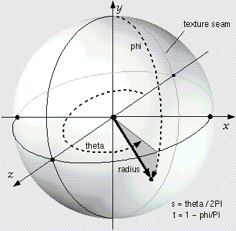

## Sphere

```
Sphere {
  SFFloat   radius        1   # (-inf,inf)
  SFInt32   subdivision   1   # [0,5] or 10
}
```

The [Sphere](reference/sphere.md#sphere) node specifies a sphere centered at
(0,0,0) in the local coordinate system. The `radius` field specifies the radius
of the sphere (see ).

If `radius` is positive, the outside faces of the sphere are displayed while if
it is negative, the inside faces are displayed.

%figure "Sphere node"

%end

The `subdivision` field controls the number of faces of the rendered sphere.
Spheres are rendered as icosahedrons with 20 faces when the subdivision field is
set to 0. If the subdivision field is 1 (default value), then each face is
subdivided into 4 faces, making 80 faces. With a subdivision field set to 2, 320
faces will be rendered, making the sphere very smooth. A maximum value of 5
(corresponding to 20480 faces) is allowed for this subdivision field to avoid a
very long rendering process. A value of 10 will turn the sphere appearance into
a black and white soccer ball.

When a texture is applied to a sphere, the texture covers the entire surface,
wrapping counterclockwise from the back of the sphere. The texture has a seam at
the back where the *yz*-plane intersects the sphere.
[TextureTransform](reference/texturetransform.md#texturetransform) affects the
texture coordinates of the Sphere.

