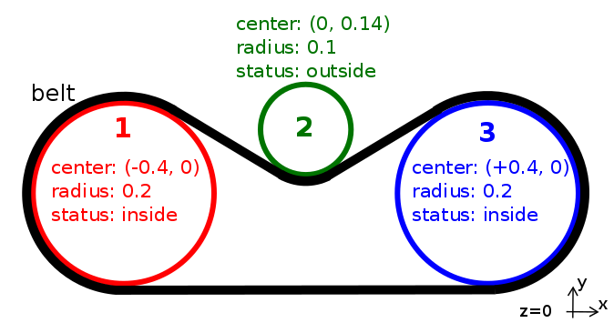

## Track

Derived from [Solid](reference/solid.md#solid).

```
Track {
  MFNode     device            []
  SFVec3f    textureAnimation  0 0
  SFNode     animatedGeometry  NULL
  SFInt32    geometriesCount   10
}
```

The [Track](reference/track.md#track) node defines a track object that could be
used to model tracks for conveyor belts or tank robots.

Note that this works only in *physics-based* simulation. Therefore, the
`physics` and `boundingObject` fields of the [Track](reference/track.md#track)
node and related [Solid](reference/solid.md#solid) nodes must be defined to work
properly.

The `device` field optionally specifies a
[LinearMotor](reference/linearmotor.md#linearmotor), a linear
[PositionSensor](reference/positionsensor.md#positionsensor) and a
[Brake](reference/brake.md#brake) device. The motor allows to control the motion
of the track, and if not specified the track will behave like a fixed joint.
Position, velocity or force control can be used but force feedback functions are
not available.

The track system doesn't have any default wheel, but it is possible to insert a
[TrackWheel](reference/trackwheel.md#trackwheel) node in the `children` field to
define an object that will automatically rotate based on its `radius` value and
the [Track](reference/track.md#track) motor speed.

Other than the motion, it is also possible to define an animation to show
graphically the movement of the track. Two different types of animation are
available: texture animation and geometries animation.

### Texture Animation

The texture animation is the simplest option and consists in scrolling the
texture object in the direction defined in the `textureAnimation` field. This
scroll value is combined with the belt velocity in order to update the position
of texture at each time step. If the value is *[0 0]* the texture will not move.
Only the first child of the [Track](reference/track.md#track) is taken into
consideration for texture animation, and it has to be a
[Shape](reference/shape.md#shape), a [Group](reference/group.md#group) node or a
[Group](reference/group.md#group) descendant having a
[Shape](reference/shape.md#shape) node as its first child.

### Geometries Animation

The geometries animation consists of a set of pure graphical
[Shape](reference/shape.md#shape) objects without physics properties moving
along a defined belt path.

The `animatedGeometry` field contains the specification of the appearance and
geometry of the animated objects.

The `geometriesCount` field specifies the number of animated objects that will
move along the belt path.

The belt path along which the animated geometries will move is shaped to the
[TrackWheel](reference/trackwheel.md#trackwheel) nodes contained in the
`children` field. Each wheel contains the information about its center position,
its radius and if it is inside or outside the belt. By convention the wheels are
all aligned along the z-axis of the [Track](reference/track.md#track) node and
have to be defined in clockwise order starting from the one having the smallest
x-axis value. The following code fragment shows the belt path definition for the
convex track example shown in :

```
children [
  TrackWheel {
   position -0.4 0.4
    radius 0.2
    inner TRUE
  }
  TrackWheel {
    position 0.4 0.4
    radius 0.2
    inner TRUE
  }
  TrackWheel {
    position 0.2 0.12
    radius 0.1
    inner TRUE
  }
  TrackWheel {
    position 0 0.12
    radius 0.1
    inner TRUE
  }
  TrackWheel {
    position -0.2 0.12
    radius 0.1
    inner TRUE
  }
]
```

%figure "Convex track's belt shape example"

%end

Then for a concave track belt shape like the one shown in the following
[TrackWheel](reference/trackwheel.md#trackwheel) nodes have to be defined:

```
children [
  TrackWheel {
    position -0.4 0.0
    radius 0.2
    inner TRUE
  }
  TrackWheel {
    position -0.0 0.14
    radius 0.1
    inner FALSE
  }
  TrackWheel {
    position 0.4 0.0
    radius 0.2
    inner TRUE
  }
]
```

%figure "Concave track's belt shape example"

%end

