## Walking parameters

This appendix explains all the parameters that can be set in the configuration file (.ini) to tune the gait.

`X offset` is the offset of the feet in the X direction.
Unit is in millimeter.

%figure "Walking: x offset parameter"

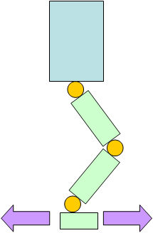

%end

`Y offset` is the offset of the feet in the Y direction.
Unit is in millimeter.

%figure "Walking: y offset parameter"

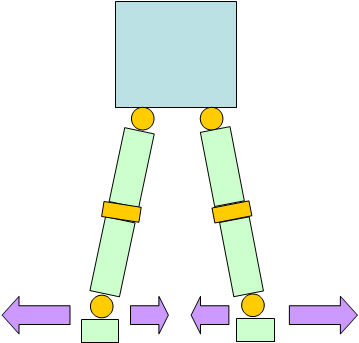

%end

`Z offset` is the offset of the feet in the Z direction.
Unit is in millimeter.

%figure "Walking: z offset parameter"

%end

`Roll offset` is the angle offset at the feet along X axis.
Unit is in degree.

%figure "Walking: roll offset parameter"

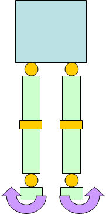

%end

`Pitch offset` is the angle offset at the feet along Y axis.
Unit is in degree.

%figure "Walking: pitch offset parameter"

%end

`Yaw offset` is the angle offset of the leg along Z axis.
Unit is in degree.

%figure "Walking: yaw offset parameter"

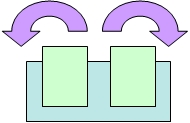

%end

`Hip pitch offset` is the tilt of the robot's body.
It uses a special unit of the motor correspondig to 2.85 degree.

%figure "Walking: hip pitch offset parameter"

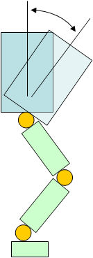

%end

`Period time` is the time required for the robot to complete two full steps (left and right foot).
Unit is in millisecond.

%figure "Walking: period time parameter"

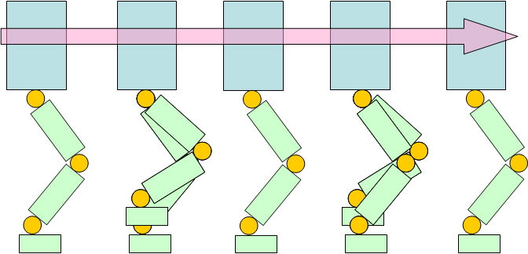

%end

`DSP ratio` is the ratio between the time when both feet are on the ground to only one foot (either left or right) is on the ground.

%figure "Walking: dsp ratio parameter"

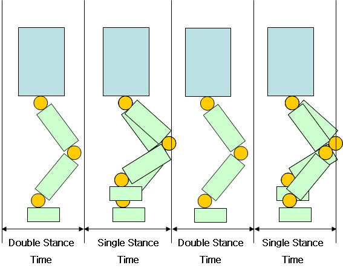

%end

`Step forward back ratio` is the differential distance according to X direction, between the left and right foot during walk.
Unit is in millimeter.

%figure "Walking: step forward back ratio parameter"

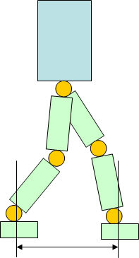

%end

`Foot height` is the maximum height of the foot during the step.
Unit is in millimeter.

%figure "Walking: foot height parameter"

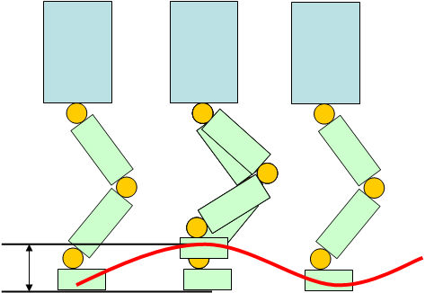

%end

`Swing right left` is the left and right swaying of the body during walking.
Unit is in millimeter.

%figure "Walking: swing right left parameter"

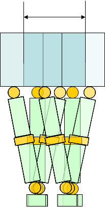

%end

`Swing top down` is the up and down swaying of the body during walking.
Unit is in millimeter.

%figure "Walking: swing top down parameter"

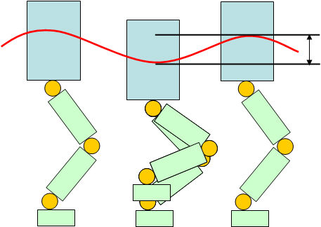

%end

`Pelvis offset` is angle offset at the pelvis along X axis.
It uses a special unit of the motor correspondig to 2.85 degree.

%figure "Walking: pelvis offset parameter"

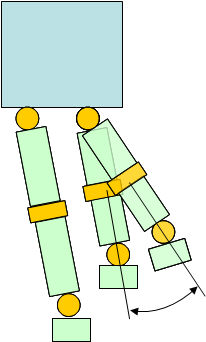

%end

`Arm swing gain` is the gain that influences the movement of the arm during walking.

`Balance knee gain` is the gain at the knee level for the front/back balance.

`Balance ankle pitch gain` is the gain at the ankle level for the front/back balance.

`Balance hip roll gain` is the gain at the hip level for the lateral balance.
Since the lateral balance does not work very well in simulation, we recommend you to set this parameter to 0.

`Balance ankle roll gain` is the gain at the ankle level for the lateral balance.
Since the lateral balance does not work very well in simulation, we recommend you to set this parameter to 0.
